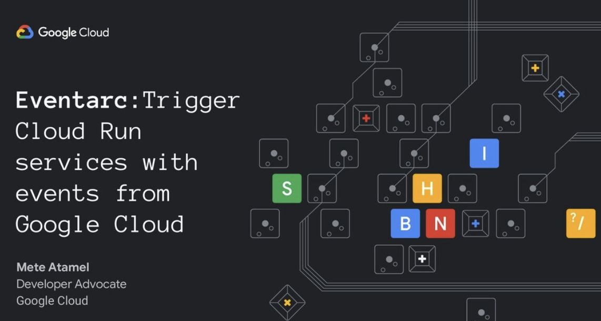

# Eventarc Samples

[Eventarc](https://cloud.google.com/eventarc/) lets you asynchronously deliver
events from Google services, SaaS, and your own apps using loosely coupled
services that react to state changes. Eventarc requires no infrastructure
management — you can optimize productivity and costs while building a modern,
event-driven solution.

This repository contains a collection of samples for Eventarc for various use
cases.

## Eventarc Slides

There's a
[presentation](https://speakerdeck.com/meteatamel/eventarc-trigger-cloud-run-services-with-events-from-google-cloud)
that explains Eventarc.

<!--  -->

## Samples

* [Image processing pipeline](docs/image-processing-pipeline-eventarc.md)
* [BigQuery processing pipeline](docs/bigquery-processing-pipeline-eventarc.md)
* [Terraform sample](docs/terraform.md)
* Eventarc and Workflows Integration
  * [AuditLog-Cloud Storage and Workflows](docs/eventarc-auditlog-storage-workflows.md)
  * [Pub/Sub and Workflows](docs/eventarc-pubsub-workflows.md)

-------

This is not an official Google product.
