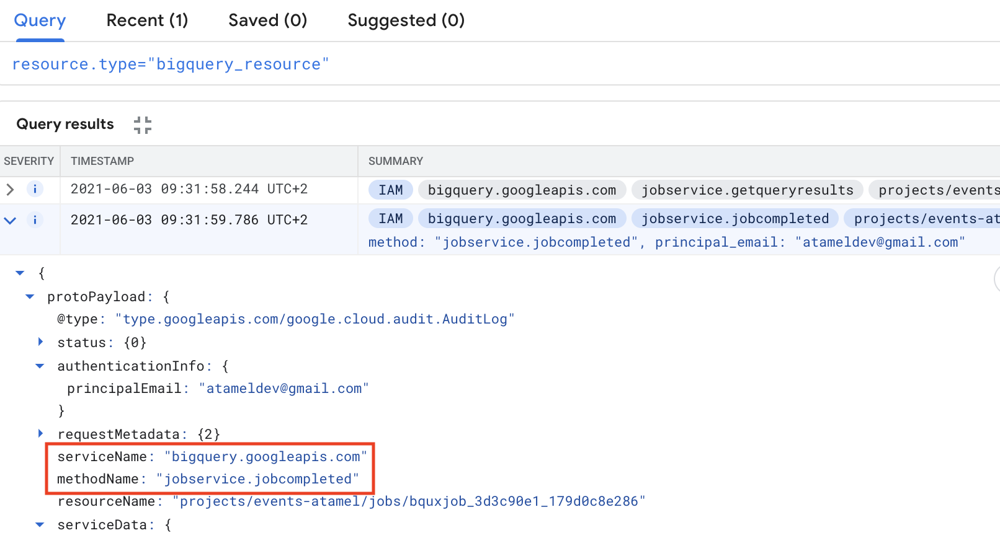
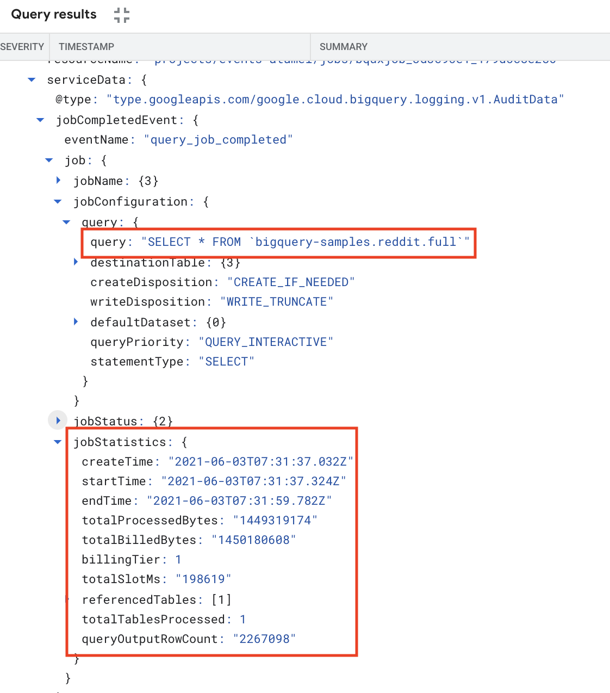

# Expensive BigQuery jobs notifier with Eventarc and SendGrid

In this sample, you'll build a Cloud Run service that receives notifications of
completed BigQuery jobs using Eventarc, determines if the BigQuery job was
expensive to run and if so, sends a notification email using SendGrid.

## Determine completed & expensive BigQuery jobs

You can check AuditLogs of BigQuery for all the information. Note that AuditLogs
are enabled by default in BigQuery.

To see completed BigQuery jobs, you can see AuditLogs logged under
`serviceName` of `bigquery.googleapis.com` and `methodName` of `jobservice.jobcompleted`:



To get more job details, you can check under `jobsCompletedEvent` where you have
access to what query was executed and more importantly how much it cost under
`totalBilledBytes`:



`totalBilledBytes` gives you an idea how expensive the query was. For example,
if the query was cached, this will be zero and cost nothing but for expensive
queries, it will be in GBs or more. In this sample, we'll assume queries 1GB or
more are expensive.

## Before you begin

Before deploying services and triggers, go through some setup steps.

### Default Compute service account

Default compute service account will be used in the Audit Log triggers of Eventarc. Grant the
`eventarc.eventReceiver` role to the default compute service account:

```sh
export PROJECT_NUMBER="$(gcloud projects describe $(gcloud config get-value project) --format='value(projectNumber)')"

gcloud projects add-iam-policy-binding $(gcloud config get-value project) \
    --member=serviceAccount:${PROJECT_NUMBER}-compute@developer.gserviceaccount.com \
    --role='roles/eventarc.eventReceiver'
```

### Region, location, platform

Set region, location and platform for Cloud Run and Eventarc:

```sh
export REGION=us-central1
export GOOGLE_CLOUD_PROJECT=$(gcloud config get-value project)

gcloud config set run/platform managed
gcloud config set run/region ${REGION}
gcloud config set eventarc/location ${REGION}
```

## Notifier

This service will receive the BigQuery `jobcompleted` events, log the received
event and if `totalBilledBytes` is more than 1GB, it will use SendGrid to send an
email about the expensive query.

You need to setup a SendGrid account and create an API key. You can follow
SendGrid's API Keys [doc](https://app.sendgrid.com/settings/api_keys) for more
details on how to setup SendGrid.

The code of the service is in [app.py](app.py). You can take a look how to parse
the received CloudEvent, how to parse the AuditLog with the relevant info and
finally how to send an email for expensive queries.

Build and push the container image:

```sh
export SERVICE_NAME=bigquery-usage-notifier
export GOOGLE_CLOUD_PROJECT=$(gcloud config get-value project)
gcloud builds submit --tag gcr.io/${GOOGLE_CLOUD_PROJECT}/${SERVICE_NAME}
```

Deploy the service while passing in `TO_EMAILS` to email address where you want
to send the notification and `SENDGRID_API_KEY` with your send SendGrid API Key.

```sh
export TO_EMAILS=youremail@gmail.com
export SENDGRID_API_KEY=yoursendgridapikey

gcloud run deploy ${SERVICE_NAME} \
  --image gcr.io/${GOOGLE_CLOUD_PROJECT}/${SERVICE_NAME} \
  --allow-unauthenticated \
  --update-env-vars TO_EMAILS=${TO_EMAILS},SENDGRID_API_KEY=${SENDGRID_API_KEY}
```

## Trigger

Once the service is deployed, create a trigger to filter for the right BigQuery
events:

```sh
gcloud eventarc triggers create ${SERVICE_NAME}-trigger \
  --destination-run-service=${SERVICE_NAME} \
  --destination-run-region=${REGION} \
  --event-filters="type=google.cloud.audit.log.v1.written" \
  --event-filters="serviceName=bigquery.googleapis.com" \
  --event-filters="methodName=jobservice.jobcompleted" \
  --service-account=${PROJECT_NUMBER}-compute@developer.gserviceaccount.com
```

Before testing, make sure the trigger is ready:

```sh
gcloud eventarc triggers list

NAME                                ACTIVE
bigquery-usage-notifier-trigger      Yes
```

## Test

To test, you need to run a BigQuery job that results in 1GB or more billed
bytes. Here's a sample query to run using `bq` CLI:

```sh
bq query \
  --nouse_legacy_sql \
  --nouse_cache \
  'SELECT * FROM `bigquery-samples`.reddit.full'
```

Once the query completes, you should see the Cloud Run service log the query and
you should also receive an email like this one:

```
The following BigQuery job completed

principalEmail: atameldev@gmail.com
jobId: bqjob_r3293aa18ce3b8bed_00000179e689b8b9_1
createTime: 2021-06-07T12:54:16.783Z
query: SELECT * FROM `bigquery-samples`.reddit.full
totalBilledBytes: 1450180608.0, above 1GB? True
```