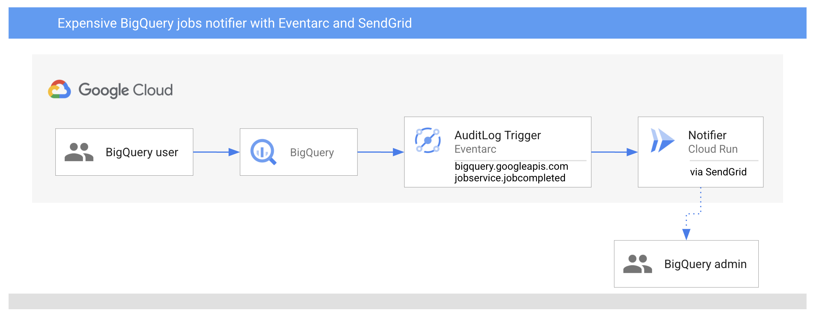

# Expensive BigQuery jobs notifier - Cloud Functions v2

> **Note:** Cloud Functions v2 is currently a feature in *private preview*.
> Only allowlisted projects can currently take advantage of it. Please fill out
> [this form](https://docs.google.com/forms/d/e/1FAIpQLSeaZYta3UR-QCYUEByvIyNbQab63lQBIYhCQfrItp7zYrnATw/viewform)
> to get your project allowlisted before attempting this sample.
> Cloud Functions v2 is only available in us-west1. More regions are coming
> soon.

In this sample, you'll build a Cloud Functions v2 service that receives
notifications of completed BigQuery jobs using Eventarc, determines if the
BigQuery job was expensive to run and if so, sends a notification email using
SendGrid.



## Determine completed & expensive BigQuery jobs

You can check AuditLogs of BigQuery for all the information. Note that AuditLogs
are enabled by default in BigQuery.

To see completed BigQuery jobs, you can see AuditLogs logged under
`serviceName` of `bigquery.googleapis.com` and `methodName` of `jobservice.jobcompleted`:


To get more job details, you can check under `jobsCompletedEvent` where you have
access to what query was executed and more importantly how much it cost under
`totalBilledBytes`:


`totalBilledBytes` gives you an idea how expensive the query was. For example,
if the query was cached, this will be zero and cost nothing but for expensive
queries, it will be in GBs or more. In this sample, we'll assume queries 1GB or
more are expensive.

## Before you begin

Before deploying services and triggers, go through some setup steps.

### Enable APIs

Make sure that the project id is setup:

```sh
gcloud config set project [YOUR-PROJECT-ID]
PROJECT_ID=$(gcloud config get-value project)
```

Enable all necessary services:

```sh
gcloud services enable artifactregistry.googleapis.com
gcloud services enable cloudfunctions.googleapis.com
gcloud services enable run.googleapis.com
gcloud services enable eventarc.googleapis.com
gcloud services enable cloudbuild.googleapis.com
```

### Enable Audit Logs

You will use [Audit Logs](https://console.cloud.google.com/iam-admin/audit)
trigger for BigQuery which are enabled by default, nothing to do here.

### Configure a service account

Default compute service account will be used in the Audit Log triggers of Eventarc. Grant the
`eventarc.eventReceiver` role to the default compute service account:

```sh
PROJECT_NUMBER="$(gcloud projects describe $(gcloud config get-value project) --format='value(projectNumber)')"

gcloud projects add-iam-policy-binding $(gcloud config get-value project) \
    --member=serviceAccount:$PROJECT_NUMBER-compute@developer.gserviceaccount.com \
    --role='roles/eventarc.eventReceiver'
```

### Create a bucket for deployments

Currently, Cloud Functions v2 only supports deployments from a Cloud Storage
bucket. Create a regional bucket that you will use for your function code later:

```sh
REGION=us-west1
BUCKET=gs://$PROJECT_ID-functions-src
gsutil mb -l $REGION $BUCKET
```

## Notifier

This service will receive the BigQuery `jobcompleted` events, log the received
event and if `totalBilledBytes` is more than 1GB, it will use SendGrid to send an
email about the expensive query.

You need to setup a SendGrid account and create an API key. You can follow
SendGrid's API Keys [doc](https://app.sendgrid.com/settings/api_keys) for more
details on how to setup SendGrid.

The code of the service is in [main.py](main.py). You can take a look how to parse
the received CloudEvent, how to parse the AuditLog with the relevant info and
finally how to send an email for expensive queries.

Inside the source folder, zip the source and upload to the bucket:

```sh
zip -r source.zip *
gsutil cp source.zip $BUCKET
```

Deploy the service while passing in `TO_EMAILS` to email address where you want
to send the notification and `SENDGRID_API_KEY` with your send SendGrid API Key.

```sh
TO_EMAILS=youremail@gmail.com
SENDGRID_API_KEY=yoursendgridapikey
SERVICE_NAME=bigquery-usage-notifier
TRIGGER_LOCATION=us-central1

gcloud alpha functions deploy $SERVICE_NAME \
  --v2 \
  --runtime python38 \
  --entry-point handle_audit_log \
  --source $BUCKET/source.zip \
  --region $REGION \
  --trigger-location $TRIGGER_LOCATION \
  --trigger-event-filters="type=google.cloud.audit.log.v1.written,serviceName=bigquery.googleapis.com,methodName=jobservice.jobcompleted" \
  --update-env-vars TO_EMAILS=$TO_EMAILS,SENDGRID_API_KEY=$SENDGRID_API_KEY
```

See that the service is deployed:

```sh
gcloud alpha functions list --v2
```

## Trigger

> **Note:** Although your Audit Log function trigger will be created
> immediately, it can take up to 10 minutes for trigger to be active.

Once the service is deployed, a trigger is created under the covers.

Make sure the trigger is ready by checking `ACTIVE` flag:

```sh
gcloud eventarc triggers list
```

## Test

To test, you need to run a BigQuery job that results in 1GB or more billed
bytes. Here's a sample query to run using `bq` CLI:

```sh
bq query \
  --nouse_legacy_sql \
  --nouse_cache \
  'SELECT * FROM `bigquery-samples`.reddit.full'
```

Once the query completes, you should see the service log the query:

```sh
gcloud alpha functions logs read $SERVICE_NAME --region $REGION --v2 --limit=100
```

You should also receive an email like this one:

```sh
The following BigQuery job completed

principalEmail: atameldev@gmail.com
jobId: bqjob_r3293aa18ce3b8bed_00000179e689b8b9_1
createTime: 2021-06-07T12:54:16.783Z
query: SELECT * FROM `bigquery-samples`.reddit.full
totalBilledBytes: 1450180608.0, above 1GB? True
```
