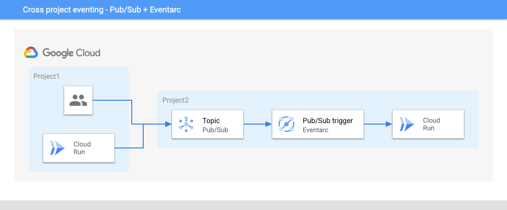

# Cross project eventing

By default, Eventarc routes events from sources to targets in a single project.
However, it's possible to deliver events across projects with some additional setup.

As a recap, Eventarc has 3 trigger types: Pub/Sub trigger, Cloud Storage
trigger, Audit Logs trigger to route corresponding events to Cloud Run, Cloud
Functions, etc.

Let's take a look how to route each event type across projects.

## Pub/Sub

Pub/Sub is a global service. This means one can create a topic in one project
and publish to that topic from another project. This allows the following setup
where users or services in one project can publish messages to a topic in
another project and those messages a routed to a Cloud Run service via an
Eventarc Pub/Sub trigger:



Let's see how to set this up.

First, make sure your project id and region are set:

```sh
gcloud config set project [YOUR-PROJECT-ID]
PROJECT_ID=$(gcloud config get-value project)
REGION=us-central1
```

In the second project, create a topic:

```sh
TOPIC_ID=my-topic
gcloud pubsub topics create $TOPIC_ID
```

Deploy a Cloud Run service:

```sh
gcloud run deploy hello \
    --image=gcr.io/cloudrun/hello \
    --allow-unauthenticated \
    --region=$REGION
```

Connect the topic to the service with an Eventarc trigger:

```sh
gcloud eventarc triggers create trigger-cross-project-pubsub \
  --destination-run-service=hello \
  --destination-run-region=$REGION \
  --location=$REGION \
  --event-filters="type=google.cloud.pubsub.topic.v1.messagePublished" \
  --transport-topic=projects/$PROJECT_ID/topics/$TOPIC_ID
```

Now, from the first project and publish a message to the topic:

```sh
 gcloud pubsub topics publish projects/$PROJECT_ID/topics/$TOPIC_ID --message="hello"
```

If you check the logs of the Cloud Run service, you should see that it received the message:

```sh
Received event of type google.cloud.pubsub.topic.v1.messagePublished. Event data: hello
```

## Cloud Storage

TODO

## Audit Logs

TODO
