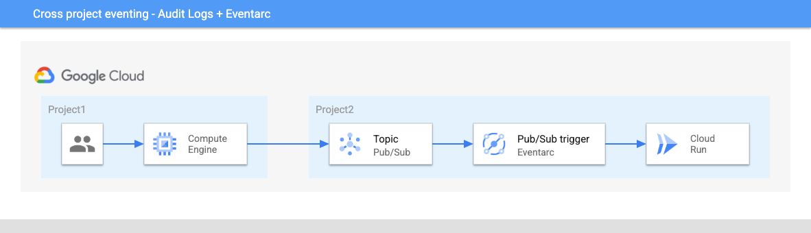

# Cross project eventing

By default, Eventarc routes events from sources to targets in a single project.
However, it's possible to deliver events across projects with some additional setup.

As a recap, Eventarc has 3 trigger types: Pub/Sub trigger, Cloud Storage
trigger, Cloud Audit Logs trigger to route corresponding events to Cloud Run, Cloud
Functions, etc.

Let's take a look how to route each event type across 2 projects.

## Pub/Sub

Pub/Sub is a global service. This means one can create a topic in one project
and publish to that topic from another project. This allows the following setup
where users or services in one project can publish messages to a topic in
another project and get those messages routed to a Cloud Run service via an
Eventarc Pub/Sub trigger:


Let's see how to set this up.

In the second project, set the project id and region:

```sh
gcloud config set project [YOUR-PROJECT2]
PROJECT2=$(gcloud config get-value project)
REGION=us-central1
```

Create a topic:

```sh
TOPIC=my-topic
gcloud pubsub topics create $TOPIC
```

Deploy a Cloud Run service:

```sh
gcloud run deploy hello \
    --image=gcr.io/cloudrun/hello \
    --allow-unauthenticated \
    --region=$REGION
```

Connect the topic to the service with an Eventarc trigger:

```sh
gcloud eventarc triggers create trigger-cross-project-pubsub \
  --destination-run-service=hello \
  --destination-run-region=$REGION \
  --location=$REGION \
  --event-filters="type=google.cloud.pubsub.topic.v1.messagePublished" \
  --transport-topic=projects/$PROJECT2/topics/$TOPIC
```

Now, from the first project and publish a message to the topic:

```sh
 gcloud pubsub topics publish projects/$PROJECT2/topics/$TOPIC --message="hello"
```

In the second project, check the logs of the Cloud Run service, you should see that it received the message:

```sh
Received event of type google.cloud.pubsub.topic.v1.messagePublished. Event data: hello
```

## Cloud Storage

You can use the [Pub/Sub notifications for Cloud
Storage](https://cloud.google.com/storage/docs/pubsub-notifications) to publish
Cloud Storage events from one project to another and get those events routed to
a Cloud Run service via an Eventarc Pub/Sub trigger:


Let's see how to set this up. We'll use the Pub/Sub topic, the Pub/Sub trigger
and the Cloud Run service from the second project.

In the first project, create a bucket to listen events from:

```sh
gcloud config set project [YOUR-PROJECT1]
PROJECT1=$(gcloud config get-value project)
BUCKET=$PROJECT1-cross-project
gsutil mb -l $REGION gs://$BUCKET
```

Create a Pub/Sub notification for the bucket in the first project to the topic in the second project:

```sh
gsutil notification create -t projects/$PROJECT2/topics/$TOPIC -f json gs://$BUCKET
```

Now, upload a file to the bucket:

```sh
echo "Hello World" > random.txt
gsutil cp random.txt gs://$BUCKET/random.txt
```

In the second project, check the logs of the Cloud Run service, you should see
that it received the Cloud Storage event (wrapped in various layers):

```sh
Received event of type google.cloud.pubsub.topic.v1.messagePublished. Event data: {
  "kind": "storage#object",
  "id": "project1-cross-project/random.txt/1635327604259719",
  "selfLink": "https://www.googleapis.com/storage/v1/b/project1-cross-project/o/random.txt",
  "name": "random.txt",
  "bucket": "project1-cross-project",
  "generation": "1635327604259719",
...
}
```

## Cloud Audit Logs

You can use the [logging sinks](https://cloud.google.com/logging/docs/export/configure_export_v2) to publish
Cloud Audit Logs from one project to another and get those events routed to
a Cloud Run service via an Eventarc Pub/Sub trigger.

For example, one can enable Cloud Audit Logs for Compute Engine in the first project.
When a user creates a new VM in the first project, a new Audit Log is created
and this gets routed to a Cloud Run service in the second project:



Let's see how to set this up. We'll use the Pub/Sub topic, the Pub/Sub trigger
and the Cloud Run service from the second project.

In the first project, make sure the Cloud Audit Logs for Compute Engine are enabled.
When you create a new VM, you should see Cloud Audit Logs like this:

```json
{
  "protoPayload": {
    "@type": "type.googleapis.com/google.cloud.audit.AuditLog",
    "serviceName": "compute.googleapis.com",
    "methodName": "beta.compute.instances.insert",
 ...
}
```

Create a logging sink to route these Cloud Audit Logs to the topic in the second
project:

```sh
gcloud logging sinks create cross-project-sink \
  pubsub.googleapis.com/projects/$PROJECT2/topics/$TOPIC \
  --log-filter='protoPayload.methodName="beta.compute.instances.insert"'
```

This will remind you to grant the logging sink's service account the Pub/Sub
publisher role on the topic:

```sh
Please remember to grant `serviceAccount:p1011272509317-375795@gcp-sa-logging.iam.gserviceaccount.com` the Pub/Sub Publisher role on the topic.
More information about sinks can be found at https://cloud.google.com/logging/docs/export/configure_export
```

In the second project, go ahead and grant the role:

```sh
gcloud pubsub topics add-iam-policy-binding $TOPIC \
  --member=serviceAccount:p1011272509317-375795@gcp-sa-logging.iam.gserviceaccount.com \
  --role=roles/pubsub.publisher
```

To test, in the first project, create a VM from Cloud Console. In the second
project, check the logs of the Cloud Run service, you should see that it
received the Audit Log Storage event (wrapped in various layers):

```sh
Received event of type google.cloud.pubsub.topic.v1.messagePublished. Eventdata: {
  "logName": "projects/workflows-atamel/logs/cloudaudit.googleapis.com%2Factivity",
  "operation": {
    "id": "operation-1635330842489-5cf5321f4f454-ecc363cd-3883c08d",
    "last": true,
    "producer": "compute.googleapis.com"
  },
  "protoPayload": {
    "@type": "type.googleapis.com/google.cloud.audit.AuditLog",
    "methodName": "beta.compute.instances.insert",
  }
...
}
```
