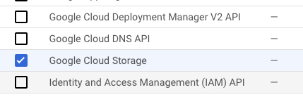

# Trigger GKE services with Eventarc events

In this sample, you will see how to trigger services running on Google
Kubernetes Engine (GKE) with events from Eventarc.

## Before you begin

First, make sure you have a Google Cloud project and the project id is set in
`gcloud`:

```sh
PROJECT_ID=your-project-id
gcloud config set project $PROJECT_ID
```

## Create a GKE cluster

Run [01_create_gke_cluster.sh](scripts/01_create_gke_cluster.sh) to enable required
services and create a GKE cluster.

Make sure the cluster creation is finished before moving onto the next step.

## Deploy a GKE service

Run [02_deploy_gke_service.sh](scripts/02_deploy_gke_service.sh) to deploy Cloud Run's [hello
container](https://github.com/GoogleCloudPlatform/cloud-run-hello) as a Kubernetes
service on GKE. This service logs received HTTP requests and CloudEvents.

Make sure the pod is running:

```sh
kubectl get pods

NAME                        READY   STATUS
hello-gke-df6469d4b-5vv22   1/1     Running
```

And the service is running:

```sh
kubectl get svc

NAME         TYPE           CLUSTER-IP    EXTERNAL-IP
hello-gke    LoadBalancer   10.51.1.26    <none>
```

## Enable Eventarc, Eventarc GKE destination, and a trigger service account

Run [03_enable_eventarc_gke.sh](scripts/03_enable_eventarc_gke.sh) to enable required
services for Eventarc, initialize GKE destinations in Eventarc and create a
service account to be used in triggers later.

## Create a Pub/Sub trigger

### Create a trigger

Run [04_create_eventarc_pubsub_trigger.sh](scripts/04_create_eventarc_pubsub_trigger.sh)
to create a Pub/Sub trigger to the deployed GKE service.

### Test the trigger

Run [05_test_eventarc_pubsub.sh](scripts/05_test_eventarc_pubsub.sh) to
find the underlying Pub/Sub topic for the trigger and send a message to that
topic.

You can then check the logs of the service by find the pod id:

```sh
kubectl get pods

NAME                        READY   STATUS
hello-gke-df6469d4b-5vv22   1/1     Running
```

Check the logs of the pod:

```sh
kubectl logs hello-gke-df6469d4b-5vv22

{
  "severity": "INFO",
  "eventType": "google.cloud.pubsub.topic.v1.messagePublished",
  "message": "Received event of type google.cloud.pubsub.topic.v1.messagePublished. Event data: Hello World",
  "event": {
    "data": {
      "subscription": "projects/atamel-eventarc-gke/subscriptions/eventarc-us-central1-trigger-pubsub-gke-sub-270",
      "message": {
        "data": "SGVsbG8gV29ybGQ=",
        "messageId": "6031025573654834",
        "publishTime": "2022-10-19T14:13:07.990Z"
      }
    },
    "datacontenttype": "application/json",
    "id": "6031025573654834",
    "source": "//pubsub.googleapis.com/projects/atamel-eventarc-gke/topics/eventarc-us-central1-trigger-pubsub-gke-729",
    "specversion": "1.0",
    "time": "2022-10-19T14:13:07.99Z",
    "type": "google.cloud.pubsub.topic.v1.messagePublished"
  }
}
```

## Create a Cloud Storage trigger

### Create a trigger

Run
[06_create_eventarc_storage_trigger.sh](scripts/06_create_eventarc_storage_trigger.sh)
to create a Cloud Storage bucket and then create a Cloud Storage trigger to the
deployed GKE service.

### Test the trigger

Run [07_test_eventarc_storage.sh](scripts/07_test_eventarc_storage.sh) to
upload a file to the bucket.

Check the logs of the pod:

```sh
kubectl logs hello-gke-df6469d4b-5vv22

{
  "severity": "INFO",
  "eventType": "google.cloud.storage.object.v1.finalized",
  "message": "Received event of type google.cloud.storage.object.v1.finalized. Event data: {\n  \"kind\": \"storage#object\",\n  \"id\": \"eventarc-gcs-atamel-eventarc-gke/random.txt/1666190425669022\",\n  \"selfLink\": \"https://www.googleapis.com/storage/v1/b/eventarc-gcs-atamel-eventarc-gke/o/random.txt\",\n  \"name\": \"random.txt\",\n  \"bucket\": \"eventarc-gcs-atamel-eventarc-gke\",\n  \"generation\": \"1666190425669022\",\n  \"metageneration\": \"1\",\n  \"contentType\": \"text/plain\",\n  \"timeCreated\": \"2022-10-19T14:40:25.678Z\",\n  \"updated\": \"2022-10-19T14:40:25.678Z\",\n  \"storageClass\": \"STANDARD\",\n  \"timeStorageClassUpdated\": \"2022-10-19T14:40:25.678Z\",\n  \"size\": \"12\",\n  \"md5Hash\": \"5Z/5eUEET4XfUpfhwwLSYA==\",\n  \"mediaLink\": \"https://storage.googleapis.com/download/storage/v1/b/eventarc-gcs-atamel-eventarc-gke/o/random.txt?generation=1666190425669022\u0026alt=media\",\n  \"contentLanguage\": \"en\",\n  \"crc32c\": \"R1jUOQ==\",\n  \"etag\": \"CJ77zIPD7PoCEAE=\"\n}\n",
  "event": {
    "bucket": "eventarc-gcs-atamel-eventarc-gke",
    "data": {
      "kind": "storage#object",
      "id": "eventarc-gcs-atamel-eventarc-gke/random.txt/1666190425669022",
      "selfLink": "https://www.googleapis.com/storage/v1/b/eventarc-gcs-atamel-eventarc-gke/o/random.txt",
      "name": "random.txt",
      "bucket": "eventarc-gcs-atamel-eventarc-gke",
      "generation": "1666190425669022",
      "metageneration": "1",
      "contentType": "text/plain",
      "timeCreated": "2022-10-19T14:40:25.678Z",
      "updated": "2022-10-19T14:40:25.678Z",
      "storageClass": "STANDARD",
      "timeStorageClassUpdated": "2022-10-19T14:40:25.678Z",
      "size": "12",
      "md5Hash": "5Z/5eUEET4XfUpfhwwLSYA==",
      "mediaLink": "https://storage.googleapis.com/download/storage/v1/b/eventarc-gcs-atamel-eventarc-gke/o/random.txt?generation=1666190425669022\u0026alt=media",
      "contentLanguage": "en",
      "crc32c": "R1jUOQ==",
      "etag": "CJ77zIPD7PoCEAE="
    },
    "datacontenttype": "application/json",
    "id": "6031255652220627",
    "source": "//storage.googleapis.com/projects/_/buckets/eventarc-gcs-atamel-eventarc-gke",
    "specversion": "1.0",
    "subject": "objects/random.txt",
    "time": "2022-10-19T14:40:25.678152Z",
    "type": "google.cloud.storage.object.v1.finalized"
  }
}
```

## Create an Audit Logs trigger

Although Cloud Storage trigger is the better way to listen for Cloud Storage
events, here we show you how to create an Audit Log trigger to do the same.

### Enable Audit Logs

In order to receive events from a service, you need to enable Audit Logs. From
the Google Cloud Console, select `IAM & Admin` and `Audit Logs` from the upper
left-hand menu. In the list of services, check `Google Cloud Storage`:



On the right hand side, make sure `Admin`, `Read` and `Write` are selected and
save:


### Create a trigger

Run
[08_create_eventarc_auditlog_storage_trigger.sh](08_create_eventarc_auditlog_storage_trigger.sh)
to create an Audit Log trigger from the bucket created earlier to the deployed GKE service.

### Test the trigger

Audit Log triggers take a little bit of time to initialize. List all triggers to
confirm that the trigger was successfully created and is `Active` field is `Yes`:

```sh
gcloud eventarc triggers list

NAME                          TYPE                                           DESTINATION     ACTIVE
trigger-auditlog-storage-gke  google.cloud.audit.log.v1.written              GKE: hello-gke  Yes
```

You can run the same
[07_test_eventarc_storage.sh](07_test_eventarc_storage.sh) to upload a file to
the bucket.

Check the logs of the pod:

```sh
kubectl logs hello-gke-df6469d4b-5vv22

{
  "severity": "INFO",
  "eventType": "google.cloud.audit.log.v1.written",
  "message": "Received event of type google.cloud.audit.log.v1.written. Event data: {\"protoPayload\":{\"status\":{},\"authenticationInfo\":{\"principalEmail\":\"atameldev@gmail.com\"},\"requestMetadata\":{\"callerIp\":\"149.71.143.227\",\"callerSuppliedUserAgent\":\"apitools Python/3.10.4 gsutil/5.14 (darwin) analytics/disabled interactive/True command/cp google-cloud-sdk/405.0.1,gzip(gfe)\",\"requestAttributes\":{\"time\":\"2022-10-19T15:05:54.144615670Z\",\"auth\":{}},\"destinationAttributes\":{}},\"serviceName\":\"storage.googleapis.com\",\"methodName\":\"storage.objects.create\",\"authorizationInfo\":[{\"resource\":\"projects/_/buckets/eventarc-gcs-atamel-eventarc-gke/objects/random.txt\",\"permission\":\"storage.objects.delete\",\"granted\":true,\"resourceAttributes\":{}},{\"resource\":\"projects/_/buckets/eventarc-gcs-atamel-eventarc-gke/objects/random.txt\",\"permission\":\"storage.objects.create\",\"granted\":true,\"resourceAttributes\":{}}],\"resourceName\":\"projects/_/buckets/eventarc-gcs-atamel-eventarc-gke/objects/random.txt\",\"serviceData\":{\"@type\":\"type.googleapis.com/google.iam.v1.logging.AuditData\",\"policyDelta\":{\"bindingDeltas\":[{\"action\":\"ADD\",\"role\":\"roles/storage.legacyObjectOwner\",\"member\":\"projectOwner:atamel-eventarc-gke\"},{\"action\":\"ADD\",\"role\":\"roles/storage.legacyObjectOwner\",\"member\":\"projectEditor:atamel-eventarc-gke\"},{\"action\":\"ADD\",\"role\":\"roles/storage.legacyObjectOwner\",\"member\":\"user:atameldev@gmail.com\"},{\"action\":\"ADD\",\"role\":\"roles/storage.legacyObjectReader\",\"member\":\"projectViewer:atamel-eventarc-gke\"}]}},\"resourceLocation\":{\"currentLocations\":[\"us-central1\"]}},\"insertId\":\"-8vmrbve7pol2\",\"resource\":{\"type\":\"gcs_bucket\",\"labels\":{\"project_id\":\"atamel-eventarc-gke\",\"bucket_name\":\"eventarc-gcs-atamel-eventarc-gke\",\"location\":\"us-central1\"}},\"timestamp\":\"2022-10-19T15:05:54.138732321Z\",\"severity\":\"INFO\",\"logName\":\"projects/atamel-eventarc-gke/logs/cloudaudit.googleapis.com%2Fdata_access\",\"receiveTimestamp\":\"2022-10-19T15:05:54.839604461Z\"}",
  "event": {
    "data": {
      "protoPayload": {
        "status": {
        },
        "authenticationInfo": {
          "principalEmail": "atameldev@gmail.com"
        },
        "requestMetadata": {
          "callerIp": "149.71.143.227",
          "callerSuppliedUserAgent": "apitools Python/3.10.4 gsutil/5.14 (darwin) analytics/disabled interactive/True command/cp google-cloud-sdk/405.0.1,gzip(gfe)",
          "requestAttributes": {
            "time": "2022-10-19T15:05:54.144615670Z",
            "auth": {
            }
          },
          "destinationAttributes": {
          }
        },
        "serviceName": "storage.googleapis.com",
        "methodName": "storage.objects.create",
        "authorizationInfo": [
          {
            "resource": "projects/_/buckets/eventarc-gcs-atamel-eventarc-gke/objects/random.txt",
            "permission": "storage.objects.delete",
            "granted": true,
            "resourceAttributes": {
            }
          },
          {
            "resource": "projects/_/buckets/eventarc-gcs-atamel-eventarc-gke/objects/random.txt",
            "permission": "storage.objects.create",
            "granted": true,
            "resourceAttributes": {
            }
          }
        ],
        "resourceName": "projects/_/buckets/eventarc-gcs-atamel-eventarc-gke/objects/random.txt",
        "serviceData": {
          "@type": "type.googleapis.com/google.iam.v1.logging.AuditData",
          "policyDelta": {
            "bindingDeltas": [
              {
                "action": "ADD",
                "role": "roles/storage.legacyObjectOwner",
                "member": "projectOwner:atamel-eventarc-gke"
              },
              {
                "action": "ADD",
                "role": "roles/storage.legacyObjectOwner",
                "member": "projectEditor:atamel-eventarc-gke"
              },
              {
                "action": "ADD",
                "role": "roles/storage.legacyObjectOwner",
                "member": "user:atameldev@gmail.com"
              },
              {
                "action": "ADD",
                "role": "roles/storage.legacyObjectReader",
                "member": "projectViewer:atamel-eventarc-gke"
              }
            ]
          }
        },
        "resourceLocation": {
          "currentLocations": [
            "us-central1"
          ]
        }
      },
      "insertId": "-8vmrbve7pol2",
      "resource": {
        "type": "gcs_bucket",
        "labels": {
          "project_id": "atamel-eventarc-gke",
          "bucket_name": "eventarc-gcs-atamel-eventarc-gke",
          "location": "us-central1"
        }
      },
      "timestamp": "2022-10-19T15:05:54.138732321Z",
      "severity": "INFO",
      "logName": "projects/atamel-eventarc-gke/logs/cloudaudit.googleapis.com%2Fdata_access",
      "receiveTimestamp": "2022-10-19T15:05:54.839604461Z"
    },
    "datacontenttype": "application/json; charset=utf-8",
    "dataschema": "https://googleapis.github.io/google-cloudevents/jsonschema/google/events/cloud/audit/v1/LogEntryData.json",
    "id": "projects/atamel-eventarc-gke/logs/cloudaudit.googleapis.com%2Fdata_access-8vmrbve7pol21666191954138732",
    "methodname": "storage.objects.create",
    "recordedtime": "2022-10-19T15:05:54.138732321Z",
    "resourcename": "projects/_/buckets/eventarc-gcs-atamel-eventarc-gke/objects/random.txt",
    "servicename": "storage.googleapis.com",
    "source": "//cloudaudit.googleapis.com/projects/atamel-eventarc-gke/logs/data_access",
    "specversion": "1.0",
    "subject": "storage.googleapis.com/projects/_/buckets/eventarc-gcs-atamel-eventarc-gke/objects/random.txt",
    "time": "2022-10-19T15:05:54.839604461Z",
    "type": "google.cloud.audit.log.v1.written"
  }
}
```
