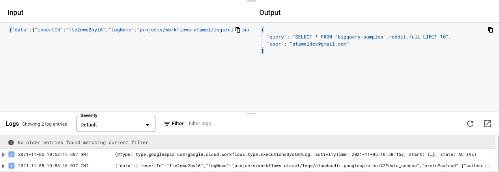

# Eventarc (AuditLog-BigQuery) and Workflows

> **Note:** Eventarc Workflows destination is currently a feature in *preview*.
> Only allow-listed projects can currently take advantage of it. Please fill out
> [this form](https://docs.google.com/forms/d/e/1FAIpQLSdgwrSV8Y4xZv_tvI6X2JEGX1-ty9yizv3_EAOVHWVKXvDLEA/viewform?resourcekey=0-1ftfaZAk_IS2J61P6r1mSw)
> to get your project allow-listed before attempting this sample.

In this sample, you will see how to connect
[Eventarc](https://cloud.google.com/eventarc/docs) events to
[Workflows](https://cloud.google.com/workflows/docs) directly.

More specifically, you will create an Eventarc AuditLog trigger to listen
for new BigQuery job completions and pass them onto a workflow.

## Deploy a workflow

First, create a [workflow.yaml](workflow.yaml). It logs the received
CloudEvent and returns the user who ran the query and the actual query.

```yaml
main:
    params: [event]
    steps:
    - log_event:
        call: sys.log
        args:
            text: ${event}
            severity: INFO
    - extract_data:
        assign:
        - user: ${event.data.protoPayload.authenticationInfo.principalEmail}
        - query: ${event.data.protoPayload.serviceData.jobCompletedEvent.job.jobConfiguration.query.query}
    - return_data:
        return:
            user: ${user}
            query: ${query}
```

Deploy the workflow:

```sh
WORKFLOW_NAME=eventarc-auditlog-bigquery-workflow

gcloud workflows deploy $WORKFLOW_NAME --source=workflow.yaml
```

## Create a service account

Create a service account for Eventarc trigger to use to invoke Workflows.

```sh
PROJECT_ID=$(gcloud config get-value project)
SERVICE_ACCOUNT=eventarc-auditlog-bigquery-sa

gcloud iam service-accounts create $SERVICE_ACCOUNT
```

Assign the `eventarc.eventReceiver` role:

```sh
gcloud projects add-iam-policy-binding $PROJECT_ID \
  --member "serviceAccount:$SERVICE_ACCOUNT@$PROJECT_ID.iam.gserviceaccount.com" \
  --role='roles/eventarc.eventReceiver'
```

Assign the `workflows.invoker` role:

```sh
gcloud projects add-iam-policy-binding $PROJECT_ID \
  --member "serviceAccount:$SERVICE_ACCOUNT@$PROJECT_ID.iam.gserviceaccount.com" \
  --role "roles/workflows.invoker"
```

## Create an Eventarc AuditLog trigger

**Note**: Normally, you'd need to enable AuditLogs for the service before
creating a trigger but BigQuery AuditLogs are enabled by default.

Create an Eventarc AuditLog trigger to listen for BigQuery job completions:

```sh
TRIGGER_NAME=trigger-auditlog-bigquery

gcloud eventarc triggers create $TRIGGER_NAME \
  --location=us-central1 \
  --destination-workflow=$WORKFLOW_NAME \
  --destination-workflow-location=us-central1 \
  --event-filters="type=google.cloud.audit.log.v1.written" \
  --event-filters="serviceName=bigquery.googleapis.com" \
  --event-filters="methodName=jobservice.jobcompleted" \
  --service-account=$SERVICE_ACCOUNT@$PROJECT_ID.iam.gserviceaccount.com
```

AuditLog triggers can take up to 10 mins to be ready. Make sure it's ready by
checking the `ACTIVE` field before testing:

```sh
gcloud eventarc triggers list --location=us-central1
NAME                       TYPE                                           DESTINATION                                     ACTIVE
trigger-auditlog-bigquery  google.cloud.audit.log.v1.written              Workflows: eventarc-auditlog-bigquery-workflow  Yes
```

## Trigger the workflow

To test, run a BigQuery job. Here's a sample query to run using `bq`:

```sh
bq query \
  --nouse_legacy_sql \
  --nouse_cache \
  'SELECT * FROM `bigquery-samples`.reddit.full LIMIT 10'
```

In the input of Workflows, you should see that the workflow received the BigQuery
event and in the output, you should see the user who ran the query and the
actual query itself:


