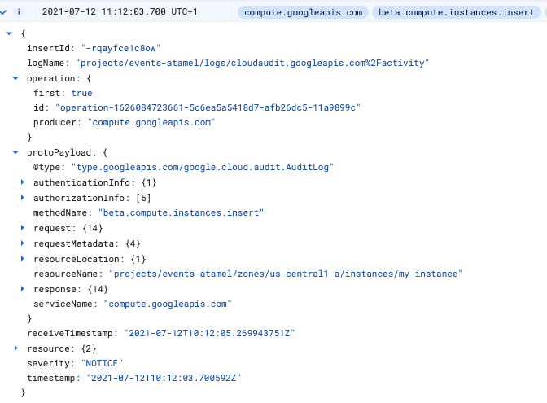
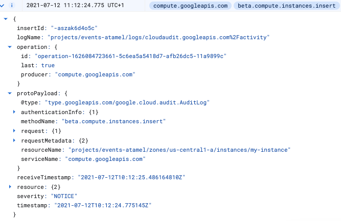

# Compute Engine VM Labeler - Cloud Functions v2

> **Note:** Cloud Functions v2 is currently a feature in *private preview*.
> Only allowlisted projects can currently take advantage of it. Please fill out
> [this form](https://docs.google.com/forms/d/e/1FAIpQLSeaZYta3UR-QCYUEByvIyNbQab63lQBIYhCQfrItp7zYrnATw/viewform)
> to get your project allowlisted before attempting this sample.
> Cloud Functions v2 is only available in us-west1. More regions are coming soon.

In this sample, you'll build a Cloud Functions v2 service that receives a notification
when a Compute Engine VM instance is created with Eventarc. In response, it adds
a label to the newly created VM, specifying the creator of the VM.

## Determine newly created Compute Engine VMs

Compute Engine emits 2 AuditLogs when a VM is created.

The first one is emitted at the beginning of VM creation as looks like this:



The second one is emitted after the VM creation and looks like this:



Notice the `operation` field with `first:true` and `last:true` values. The
second AuditLog contains all the information we need to label an instance,
therefore we will use `last:true` flag to detect it in Cloud Run.

## Before you begin

Before deploying the service and trigger, go through some setup steps.

### Enable APIs

Make sure that the project id is setup:

```sh
gcloud config set project [YOUR-PROJECT-ID]
PROJECT_ID=$(gcloud config get-value project)
```

Enable all necessary services:

```sh
gcloud services enable artifactregistry.googleapis.com
gcloud services enable cloudfunctions.googleapis.com
gcloud services enable run.googleapis.com
gcloud services enable eventarc.googleapis.com
gcloud services enable cloudbuild.googleapis.com
```

### Enable Audit Logs

You will use [Audit Logs](https://console.cloud.google.com/iam-admin/audit)
trigger for Compute Engine. Make sure `Admin Read`, `Data Read`, and `Data Write`
log types are enabled for Compute Engine.

### Configure a service account

Default compute service account will be used in the Audit Log trigger of Eventarc. Grant the
`eventarc.eventReceiver` role to the default compute service account:

```sh
PROJECT_NUMBER="$(gcloud projects describe $(gcloud config get-value project) --format='value(projectNumber)')"

gcloud projects add-iam-policy-binding $(gcloud config get-value project) \
    --member=serviceAccount:$PROJECT_NUMBER-compute@developer.gserviceaccount.com \
    --role='roles/eventarc.eventReceiver'
```

## Create a bucket for deployments

Currently, Cloud Functions v2 only supports deployments from a Cloud Storage
bucket. Create a regional bucket that you will use for your function code later:

```sh
REGION=us-west1
BUCKET=gs://$PROJECT_ID-functions-src
gsutil mb -l $REGION $BUCKET
```

## GCE VM Labeler

This service receives AuditLogs for service `compute.googleapis.com` and
method `beta.compute.instances.insert` to detect newly created VMs. Then, it
checks the received AuditLog if it's the last one in the sequence by checking
the `last:true` flag in `operation` field. If so, it extracts the relevant info from
the AuditLog such as project id, zone, instance id and uses Compute Engine API
to label the instance with the username of the creator.

The source code of the service is in [csharp](csharp) folder.

Inside the source folder, zip the source and upload to the bucket:

```sh
zip -r source.zip *
gsutil cp source.zip $BUCKET
```

Deploy the service:

```sh
SERVICE_NAME=gce-vm-labeler
TRIGGER_LOCATION=us-central1
gcloud alpha functions deploy $SERVICE_NAME \
--v2 \
--runtime dotnet3 \
--trigger-event-filters="type=google.cloud.audit.log.v1.written,serviceName=compute.googleapis.com,methodName=beta.compute.instances.insert" \
--entry-point GceVmLabeler.Function \
--source $BUCKET/source.zip \
--region $REGION \
--trigger-location $TRIGGER_LOCATION
```

> **Note:** For some reason, the trigger has to be in `us-central1` in order to
> receive Compute Engine Audit Logs and GCF v2 functions are currently only
> available in `us-west1`, hence the discrepency between the two.

See that the service is deployed:

```sh
gcloud alpha functions list --v2
```

## Trigger

> **Note:** Although your Audit Log function trigger will be created
> immediately, it can take up to 10 minutes for trigger to be active.

Once the service is deployed, a trigger is created under the covers.

Make sure the trigger is ready by checking `ACTIVE` flag:

```sh
gcloud eventarc triggers list
```

## Test

To test, you need to create a Compute Engine VM in Cloud Console (You can also
create VMs with `gcloud` but it does not seem to generate AuditLogs).

Once the VM creation completes, you should see the added `username` label on the VM in the
Cloud Console or using the following command:

```sh
gcloud compute instances describe my-instance

...
labelFingerprint: ULU6pAy2C7s=
labels:
  username: atameldev
...
```

You can also check the logs of the function as follows:

```sh
gcloud alpha functions logs read $SERVICE_NAME --region $REGION --v2 --limit=100
```
