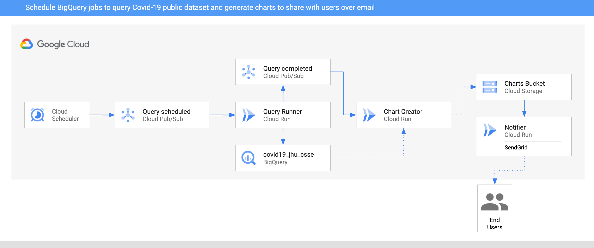

# BigQuery Processing Pipeline - Eventarc for Cloud Run for Anthos

> **Note —** Eventarc for Cloud Run for Anthos is currently a feature in *private preview*.
> Only whitelisted projects can currently take advantage of it. Please stay
> tuned for the public preview!

In this sample, we'll build an BigQuery processing pipeline to query some public
dataset on a schedule, create charts out of the data and then notify users about
the new charts via SendGrid with **Eventarc**.



1. Two `CloudScheduler` jobs are setup to call the `QueryRunner` service once
   a day for two countries via PubSub Topic `queryscheduled`.
2. `QueryRunner` receives the scheduler event for both country, queries Covid-19
   cases for the country using BigQuery's public Covid-19 dataset and saves the
   result in a separate BigQuery table. Once done, `QueryRunner` sends a Pub/Sub
   message to `querycompleted` topic.
3. `ChartCreator` receives the event from `querycompleted` topic, creates a
   chart from BigQuery data using `mathplotlib` and saves it to a Cloud Storage bucket.
4. `Notifier` receives the Cloud Storage event from the bucket via an `AuditLog`
   and sends an email notification to users using SendGrid.

## Before you begin

Before deploying services and triggers, go through some setup steps.

### Enable APIs

Make sure that the project id is setup:

```sh
gcloud config set project [YOUR-PROJECT-ID]
PROJECT_ID=$PROJECT_ID
```

Enable all necessary services:

```sh
gcloud services enable run.googleapis.com
gcloud services enable eventarc.googleapis.com
gcloud services enable logging.googleapis.com
gcloud services enable cloudbuild.googleapis.com
```

### Enable Audit Logs

You will use [Audit Logs](https://console.cloud.google.com/iam-admin/audit)
trigger for Cloud Storage. Make sure `Admin Read`, `Data Read`, and `Data Write`
log types are enabled for Cloud Storage.

### Region, location, platform

Set region, location and platform for Cloud Run and Eventarc:

```sh
CLUSTER_NAME=events-cluster
CLUSTER_LOCATION=us-central1

gcloud config set run/cluster $CLUSTER_NAME
gcloud config set run/cluster_location $CLUSTER_LOCATION
gcloud config set run/platform gke
gcloud config set eventarc/location $CLUSTER_LOCATION
```

### Create a GKE cluster with Cloud Run for Anthos add-on

Create a GKE cluster with Cloud Run for Anthos add-on:

```sh
gcloud beta container clusters create $CLUSTER_NAME \
  --addons=HttpLoadBalancing,HorizontalPodAutoscaling,CloudRun \
  --machine-type=n1-standard-4 \
  --enable-autoscaling --min-nodes=3 --max-nodes=10 \
  --no-issue-client-certificate --num-nodes=3  \
  --enable-stackdriver-kubernetes \
  --scopes=cloud-platform,logging-write,monitoring-write,pubsub \
  --zone us-central1 \
  --release-channel=rapid \
  --workload-pool=$PROJECT_ID.svc.id.goog
```

### Enable GKE destinations in Eventarc

Enable GKE destinations in Eventarc but creating a service account and binding the required roles with this command:

```sh
gcloud eventarc gke-destinations init
```

### Configure a service account

Create another service account with `roles/pubsub.subscriber` and
`roles/monitoring.metricWriter` roles. This is the minimum needed for Pub/Sub
triggers. For AuditLog triggers, you also need `roles/eventarc.eventReceiver` role:

```sh
TRIGGER_GSA=eventarc-crfa-triggers

gcloud iam service-accounts create $TRIGGER_GSA

gcloud projects add-iam-policy-binding $PROJECT_ID \
  --member "serviceAccount:$TRIGGER_GSA@$PROJECT_ID.iam.gserviceaccount.com" \
  --role "roles/pubsub.subscriber"

gcloud projects add-iam-policy-binding $PROJECT_ID \
  --member "serviceAccount:$TRIGGER_GSA@$PROJECT_ID.iam.gserviceaccount.com" \
  --role "roles/monitoring.metricWriter"

gcloud projects add-iam-policy-binding $PROJECT_ID \
  --member "serviceAccount:$TRIGGER_GSA@$PROJECT_ID.iam.gserviceaccount.com" \
  --role "roles/eventarc.eventReceiver"
```

You will use this service account in the Pub/Sub and Audit Log triggers later.

### Create a storage bucket

Create a unique storage bucket to save the charts and make sure the bucket and
the charts in the bucket are all public and in the same region as the Evenarc
trigger location:

```sh
BUCKET=$PROJECT_ID-charts-gke
gsutil mb -l $CLUSTER_LOCATION gs://$BUCKET
gsutil uniformbucketlevelaccess set on gs://$BUCKET
gsutil iam ch allUsers:objectViewer gs://$BUCKET
```

## Notifier

This service receives the Cloud Storage events and uses SendGrid to send an
email to users that a new chart has been created. You need to setup a SendGrid
account and create an API key. You can follow [this
doc](https://cloud.google.com/functions/docs/tutorials/sendgrid#preparing_the_application)
for more details on how to setup SendGrid.

### Service

The code of the service is in
[notifier](../processing-pipelines/bigquery/notifier)
folder.

Inside the
[notifier/python](../processing-pipelines/bigquery/notifier/python)
folder, build and push the container image:

```sh
SERVICE_NAME=notifier
docker build -t gcr.io/$PROJECT_ID/$SERVICE_NAME:v1 .
docker push gcr.io/$PROJECT_ID/$SERVICE_NAME:v1
```

Deploy the service while passing in `TO_EMAILS` to email address where you want
to send the notification and `SENDGRID_API_KEY` with your send SendGrid API Key.

```sh
TO_EMAILS=youremail@gmail.com
SENDGRID_API_KEY=yoursendgridapikey
gcloud run deploy $SERVICE_NAME \
  --image gcr.io/$PROJECT_ID/$SERVICE_NAME:v1 \
  --update-env-vars TO_EMAILS=$TO_EMAILS,SENDGRID_API_KEY=$SENDGRID_API_KEY,BUCKET=$BUCKET
```

### Trigger

The trigger of the service filters on Audit Logs for Cloud Storage events with
`methodName` of `storage.objects.create`.

Create the trigger:

```sh
TRIGGER_NAME=trigger-$SERVICE_NAME-gke
gcloud eventarc triggers create $TRIGGER_NAME \
  --destination-gke-cluster=$CLUSTER_NAME \
  --destination-gke-location=$CLUSTER_LOCATION \
  --destination-gke-namespace=default \
  --destination-gke-service=$SERVICE_NAME \
  --destination-gke-path=/ \
  --event-filters="type=google.cloud.audit.log.v1.written" \
  --event-filters="serviceName=storage.googleapis.com" \
  --event-filters="methodName=storage.objects.create" \
  --service-account=$TRIGGER_GSA@$PROJECT_ID.iam.gserviceaccount.com
```

## Chart Creator

This service receives the custom event from Query Runner, queries the BigQuery
table for the requested country and creates a chart out of the data using
`mathplotlib` library. Finally, the chart is uploaded to a public bucket in
Cloud Storage.

### Service

The code of the service is in [chart-creator](../processing-pipelines/bigquery/chart-creator)
folder.

Inside the
[chart-creator/python](../processing-pipelines/bigquery/chart-creator/python)
folder, build and push the container image:

```sh
SERVICE_NAME=chart-creator
docker build -t gcr.io/$PROJECT_ID/$SERVICE_NAME:v1 .
docker push gcr.io/$PROJECT_ID/$SERVICE_NAME:v1
```

Deploy the service while passing in `BUCKET` with the bucket you created earlier.

```sh
gcloud run deploy $SERVICE_NAME \
  --image gcr.io/$PROJECT_ID/$SERVICE_NAME:v1 \
  --update-env-vars BUCKET=$BUCKET
```

### Trigger

Create a Pub/Sub trigger:

```sh
TRIGGER_NAME=trigger-$SERVICE_NAME-gke
gcloud eventarc triggers create $TRIGGER_NAME \
  --destination-gke-cluster=$CLUSTER_NAME \
  --destination-gke-location=$CLUSTER_LOCATION \
  --destination-gke-namespace=default \
  --destination-gke-service=$SERVICE_NAME \
  --destination-gke-path=/ \
  --event-filters="type=google.cloud.pubsub.topic.v1.messagePublished" \
  --service-account=$TRIGGER_GSA@$PROJECT_ID.iam.gserviceaccount.com
```

Set the Pub/Sub topic in an env variable that we'll need later:

```sh
TOPIC_QUERY_COMPLETED=$(basename $(gcloud eventarc triggers describe $TRIGGER_NAME --format='value(transport.pubsub.topic)'))
```

## Query Runner

This service receives Cloud Scheduler events for each country. It uses BigQuery API
to query for the public Covid19 dataset for those countries. Once done, it saves
the results to a new BigQuery table and passes a custom event onwards.

### Service

The code of the service is in [query-runner](../processing-pipelines/bigquery/query-runner)
folder.

Inside the top level
[processing-pipelines](../processing-pipelines)
folder, build and push the container image:

```sh
SERVICE_NAME=query-runner
docker build -t gcr.io/$PROJECT_ID/$SERVICE_NAME:v1 -f bigquery/$SERVICE_NAME/csharp/Dockerfile .
docker push gcr.io/$PROJECT_ID/$SERVICE_NAME:v1
```

Deploy the service while passing in `PROJECT_ID` with your actual project id.
This is needed for the BigQuery client and `TOPIC_ID`:

```sh
gcloud run deploy $SERVICE_NAME \
  --image gcr.io/$PROJECT_ID/$SERVICE_NAME:v1 \
  --update-env-vars PROJECT_ID=$PROJECT_ID,TOPIC_ID=$TOPIC_QUERY_COMPLETED
```

### Trigger

Create a Pub/Sub trigger:

```sh
TRIGGER_NAME=trigger-$SERVICE_NAME-gke
gcloud eventarc triggers create $TRIGGER_NAME \
  --destination-gke-cluster=$CLUSTER_NAME \
  --destination-gke-location=$CLUSTER_LOCATION \
  --destination-gke-namespace=default \
  --destination-gke-service=$SERVICE_NAME \
  --destination-gke-path=/ \
  --event-filters="type=google.cloud.pubsub.topic.v1.messagePublished" \
  --service-account=$TRIGGER_GSA@$PROJECT_ID.iam.gserviceaccount.com
```

Set the Pub/Sub topic in an env variable that we'll need later:

```sh
TOPIC_QUERY_SCHEDULED=$(gcloud eventarc triggers describe $TRIGGER_NAME --format='value(transport.pubsub.topic)')
```

### Scheduler job

The service will be triggered with Cloud Scheduler. More specifically, we will
create two triggers for two countries (United Kingdom and Cyprus) and Cloud
Scheduler will emit to `queryscheduled` topic once a day for each country which
in turn will call the service.

Cloud Scheduler currently needs users to create an App Engine application.
Pick an App Engine Location and create the app:

```sh
APP_ENGINE_LOCATION=europe-west
gcloud app create --region=$APP_ENGINE_LOCATION
```

Create the scheduler job for UK:

```sh
gcloud scheduler jobs create pubsub cre-scheduler-uk \
  --schedule="0 16 * * *" \
  --topic=$TOPIC_QUERY_SCHEDULED \
  --message-body="United Kingdom"
```

Create the scheduler job for Cyprus:

```sh
gcloud scheduler jobs create pubsub cre-scheduler-cy \
  --schedule="0 17 * * *" \
  --topic=$TOPIC_QUERY_SCHEDULED \
  --message-body="Cyprus"
```

## Test the pipeline

Before testing the pipeline, make sure all the triggers are ready:

```sh
gcloud eventarc triggers list

NAME
trigger-chart-creator-gke
trigger-notifier-gke
trigger-query-runner-gke
```

You can wait for Cloud Scheduler to trigger the services or you can manually
trigger the jobs.

Find the jobs IDs:

```sh
gcloud scheduler jobs list

ID                LOCATION      SCHEDULE (TZ)         TARGET_TYPE  STATE
cre-scheduler-cy  europe-west1  0 17 * * * (Etc/UTC)  Pub/Sub      ENABLED
cre-scheduler-uk  europe-west1  0 16 * * * (Etc/UTC)  Pub/Sub      ENABLED
```

Trigger the jobs manually:

```sh
gcloud scheduler jobs run cre-scheduler-cy
gcloud scheduler jobs run cre-scheduler-uk
```

After a minute or so, you should see 2 charts in the bucket:

```sh
gsutil ls gs://$BUCKET

gs://events-atamel-charts/chart-cyprus.png
gs://events-atamel-charts/chart-unitedkingdom.png
```

You should also get 2 emails with links to the charts!
