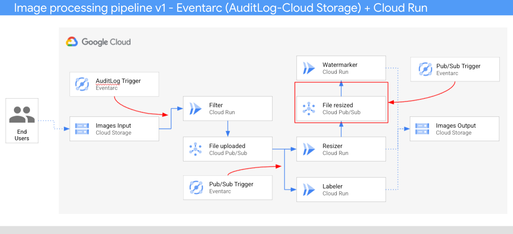

# Image processing pipeline v1 - Eventarc (AuditLog-Cloud Storage) + Cloud Run

In this sample, we'll build an image processing pipeline to connect Google Cloud
Storage events to various services with **Eventarc**.



1. An image is saved to an input Cloud Storage bucket.
2. Cloud Storage update event is read into Cloud Run via an `AuditLog`.
3. Filter service receives the Cloud Storage event. It uses Vision API to
   determine if the image is safe. If so, it creates sends a Pub/Sub message to
   `fileuploaded` topic.
4. Resizer service receives the event from `fileuploaded` topic, resizes the
   image using [ImageSharp](https://github.com/SixLabors/ImageSharp) library,
   saves to the resized image to the output bucket, sends a Pub/Sub message to
   `fileresized` topic.
5. Watermark service receives the event from `fileresized` topic, adds a
   watermark to the image using
   [ImageSharp](https://github.com/SixLabors/ImageSharp) library and saves the
   image to the output bucket.
6. Labeler receives the event from `fileuploaded` topic, extracts labels of the
   image with Vision API and saves the labels to the output bucket.

## Before you begin

Before deploying services and triggers, go through some setup steps.

### Enable APIs

Make sure that the project id is setup:

```sh
gcloud config set project [YOUR-PROJECT-ID]
PROJECT_ID=$(gcloud config get-value project)
```

Enable all necessary services:

```sh
gcloud services enable run.googleapis.com
gcloud services enable eventarc.googleapis.com
gcloud services enable cloudbuild.googleapis.com
gcloud services enable vision.googleapis.com
```

### Enable Audit Logs

You will use [Audit Logs](https://console.cloud.google.com/iam-admin/audit)
trigger for Cloud Storage. Make sure `Admin Read`, `Data Read`, and `Data Write`
log types are enabled for Cloud Storage.

### Region, location, platform

Set region, location and platform for Cloud Run and Eventarc:

```sh
REGION=europe-west1

gcloud config set run/region $REGION
gcloud config set run/platform managed
gcloud config set eventarc/location $REGION
```

### Configure a service account

Default compute service account will be used in Audit Log triggers. Grant the
`eventarc.eventReceiver` role to the default compute service account:

```sh
PROJECT_NUMBER=$(gcloud projects describe $PROJECT_ID --format='value(projectNumber)')

gcloud projects add-iam-policy-binding $PROJECT_ID \
    --member=serviceAccount:$PROJECT_NUMBER-compute@developer.gserviceaccount.com \
    --role='roles/eventarc.eventReceiver'
```

### Create storage buckets

Create 2 unique storage buckets to save pre and post processed images. Make sure
the bucket is in the same region as your Cloud Run service:

```sh
BUCKET1=$PROJECT_ID-images-input
BUCKET2=$PROJECT_ID-images-output
gsutil mb -l $REGION gs://$BUCKET1
gsutil mb -l $REGION gs://$BUCKET2
```

## Watermark

This service receives the event, adds the watermark to the image using
[ImageSharp](https://github.com/SixLabors/ImageSharp) library and saves the
image to the output bucket.

### Service

The code of the service is in [watermarker](watermarker)
folder.

Inside the top level
[processing-pipelines](../processing-pipelines)
folder, build and push the container image:

```sh
SERVICE_NAME=watermarker
docker build -t gcr.io/$PROJECT_ID/$SERVICE_NAME:v1 -f image-v1/$SERVICE_NAME/csharp/Dockerfile .
docker push gcr.io/$PROJECT_ID/$SERVICE_NAME:v1
```

Deploy the service:

```sh
gcloud run deploy $SERVICE_NAME \
  --image gcr.io/$PROJECT_ID/$SERVICE_NAME:v1 \
  --update-env-vars BUCKET=$BUCKET2
  --allow-unauthenticated
```

### Trigger

Create a Pub/Sub trigger:

```sh
TRIGGER_NAME=trigger-$SERVICE_NAME
gcloud eventarc triggers create $TRIGGER_NAME \
  --destination-run-service=$SERVICE_NAME \
  --destination-run-region=$REGION
  --event-filters="type=google.cloud.pubsub.topic.v1.messagePublished"
```

Set the Pub/Sub topic in an env variable that we'll need later:

```sh
TOPIC_FILE_RESIZED=$(basename $(gcloud eventarc triggers describe $TRIGGER_NAME --format='value(transport.pubsub.topic)'))
```

## Resizer

This service receives the event, resizes the image using
[ImageSharp](https://github.com/SixLabors/ImageSharp) library and passes the
event onwards.

### Service

The code of the service is in [resizer](resizer)
folder.

Inside the top level
[processing-pipelines](../processing-pipelines)
folder, build and push the container image:

```sh
SERVICE_NAME=resizer
docker build -t gcr.io/$PROJECT_ID/$SERVICE_NAME:v1 -f image-v1/$SERVICE_NAME/csharp/Dockerfile .
docker push gcr.io/$PROJECT_ID/$SERVICE_NAME:v1
```

Deploy the service:

```sh
gcloud run deploy $SERVICE_NAME \
  --image gcr.io/$PROJECT_ID/$SERVICE_NAME:v1 \
  --update-env-vars BUCKET=$BUCKET2,TOPIC_ID=$TOPIC_FILE_RESIZED,PROJECT_ID=$PROJECT_ID \
  --allow-unauthenticated
```

### File uploaded Pub/Sub topic

Create a Pub/Sub topic for resizer and labeler services to share in their triggers.

```sh
TOPIC_FILE_UPLOADED=file-uploaded
gcloud pubsub topics create $TOPIC_FILE_UPLOADED
```

### Trigger

Create a Pub/Sub trigger with the `TOPIC_FILE_UPLOADED` as transport topic:

```sh
TRIGGER_NAME=trigger-$SERVICE_NAME
gcloud eventarc triggers create $TRIGGER_NAME \
  --destination-run-service=$SERVICE_NAME \
  --destination-run-region=$REGION
  --event-filters="type=google.cloud.pubsub.topic.v1.messagePublished" \
  --transport-topic=projects/$PROJECT_ID/topics/$TOPIC_FILE_UPLOADED
```

## Labeler

Labeler receives the event, extracts labels of the image with Vision API and
saves the labels to the output bucket.

### Service

The code of the service is in [labeler](labeler)
folder.

Inside the top level
[processing-pipelines](../processing-pipelines)
folder, build and push the container image:

```sh
SERVICE_NAME=labeler
docker build -t gcr.io/$PROJECT_ID/$SERVICE_NAME:v1 -f image-v1/$SERVICE_NAME/csharp/Dockerfile .
docker push gcr.io/$PROJECT_ID/$SERVICE_NAME:v1
```

Deploy the service:

```sh
gcloud run deploy $SERVICE_NAME \
  --image gcr.io/$PROJECT_ID/$SERVICE_NAME:v1 \
  --update-env-vars BUCKET=$BUCKET2
  --allow-unauthenticated
```

### Trigger

Create a Pub/Sub trigger with the `TOPIC_FILE_UPLOADED` as transport topic:

```sh
TRIGGER_NAME=trigger-$SERVICE_NAME
gcloud eventarc triggers create $TRIGGER_NAME \
  --destination-run-service=$SERVICE_NAME \
  --destination-run-region=$REGION
  --event-filters="type=google.cloud.pubsub.topic.v1.messagePublished" \
  --transport-topic=projects/$PROJECT_ID/topics/$TOPIC_FILE_UPLOADED
```

## Filter

This service receives Cloud Storage events for saved images. It uses Vision API
to determine if the image is safe. If so, it passes a custom event onwards.

### Service

The code of the service is in
[filter](filter)
folder.

Inside the top level
[processing-pipelines](../processing-pipelines)
folder, build and push the container image:
image:

```sh
SERVICE_NAME=filter
docker build -t gcr.io/$PROJECT_ID/$SERVICE_NAME:v1 -f image-v1/$SERVICE_NAME/csharp/Dockerfile .
docker push gcr.io/$PROJECT_ID/$SERVICE_NAME:v1
```

Deploy the service:

```sh
gcloud run deploy $SERVICE_NAME \
  --image gcr.io/$PROJECT_ID/$SERVICE_NAME:v1 \
  --update-env-vars BUCKET=$BUCKET1,TOPIC_ID=$TOPIC_FILE_UPLOADED,PROJECT_ID=$PROJECT_ID \
  --allow-unauthenticated
```

### Trigger

The trigger of the service filters on Audit Logs for Cloud Storage events with
`methodName` of `storage.objects.create`.

Create the trigger:

```sh
TRIGGER_NAME=trigger-$SERVICE_NAME
gcloud eventarc triggers create $TRIGGER_NAME \
  --destination-run-service=$SERVICE_NAME \
  --destination-run-region=$REGION
  --event-filters="type=google.cloud.audit.log.v1.written" \
  --event-filters="serviceName=storage.googleapis.com" \
  --event-filters="methodName=storage.objects.create" \
  --service-account=$PROJECT_NUMBER-compute@developer.gserviceaccount.com
```

## Test the pipeline

Before testing the pipeline, make sure all the triggers are ready:

```sh
gcloud eventarc triggers list

NAME
trigger-filter
trigger-resizer
trigger-watermarker
trigger-labeler
```

You can upload an image to the input storage bucket:

```sh
gsutil cp ../pictures/beach.jpg gs://$BUCKET1
```

After a minute or so, you should see resized, watermarked and labelled image in
the output bucket:

```sh
gsutil ls gs://$BUCKET2

gs://events-atamel-images-output/beach-400x400-watermark.jpeg
gs://events-atamel-images-output/beach-400x400.png
gs://events-atamel-images-output/beach-labels.txt
```
