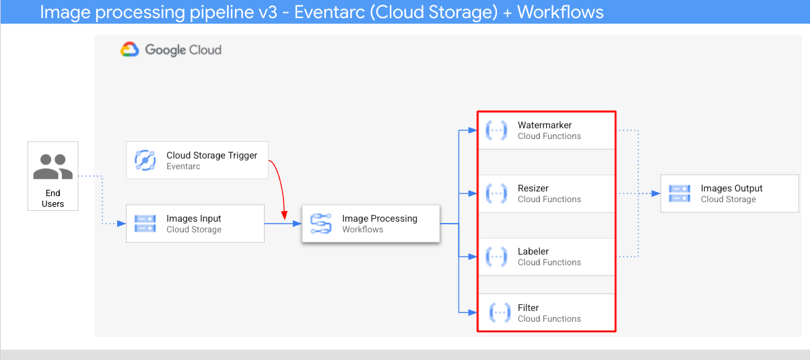

# Image processing pipeline v3 - Eventarc (Cloud Storage) + Workflows

In this sample, we'll build an image processing pipeline to read Google Cloud
Storage events with **Eventarc** and pass to a set of **Cloud Functions**
services orchestrated by **Workflows**.



1. An image is saved to an input bucket that generates a Cloud Storage create
   event.
2. Cloud Storage create event is read by Eventarc via an Cloud Storage trigger
   and passed to Workflows as a CloudEvent.
3. In the first step of workflow, Filter, a Cloud Function service, uses Vision
   API to determine if the image is safe. If the image is safe, Workflows
   continues with the next steps.
4. In second step of workflow, Labeler, a Cloud Function service, extracts labels
   of the image with Vision API and saves the labels to the output bucket.
5. In third step, Resizer, another Cloud Function service, resizes the image using
   [ImageSharp](https://github.com/SixLabors/ImageSharp) and saves to the
   resized image to the output bucket.
6. In the last step, Watermarker, a another Cloud Function service, adds a
   watermark of labels from Labeler to the resized image using
   [ImageSharp](https://github.com/SixLabors/ImageSharp) and saves the image to
   the output bucket.

## Before you begin

Before deploying services and triggers, go through some setup steps.

### Set project id

Make sure that the project id is setup:

```sh
gcloud config set project [YOUR-PROJECT-ID]
PROJECT_ID=$(gcloud config get-value project)
```

### Enable APIs

Enable all necessary services:

```sh
gcloud services enable \
  artifactregistry.googleapis.com \
  cloudbuild.googleapis.com \
  cloudfunctions.googleapis.com \
  eventarc.googleapis.com \
  run.googleapis.com \
  vision.googleapis.com \
  workflows.googleapis.com \
  workflowexecutions.googleapis.com
```

### Configure service accounts

Create a service account that you will use to in Eventarc trigger.

```sh
APP=image-processing
SERVICE_ACCOUNT=$APP-sa

gcloud iam service-accounts create $SERVICE_ACCOUNT \
  --display-name="Image processing service account"
```

Grant the `workflows.invoker` role, so the service account can be used to invoke
Workflows from Eventarc:

```sh
gcloud projects add-iam-policy-binding $PROJECT_ID \
  --role roles/workflows.invoker \
  --member serviceAccount:$SERVICE_ACCOUNT@$PROJECT_ID.iam.gserviceaccount.com
```

Grant the `pubsub.publisher` role to the Cloud Storage service account. This is
needed for the Eventarc Cloud Storage trigger:

```sh
PROJECT_NUMBER=$(gcloud projects describe $PROJECT_ID --format='value(projectNumber)')
STORAGE_SERVICE_ACCOUNT="$(gsutil kms serviceaccount -p $PROJECT_NUMBER)"

gcloud projects add-iam-policy-binding $PROJECT_NUMBER \
    --member serviceAccount:$STORAGE_SERVICE_ACCOUNT \
    --role roles/pubsub.publisher
```

## Create storage buckets

Create 2 unique storage buckets to save pre and post processed images.

```sh
REGION=us-central1
BUCKET1=$PROJECT_ID-images-input
BUCKET2=$PROJECT_ID-images-output

gsutil mb -l $REGION gs://$BUCKET1
gsutil mb -l $REGION gs://$BUCKET2
```

## Watermarker

This Cloud Functions service receives the bucket, file and labels information, reads the
file, adds the labels as watermark to the image using
[ImageSharp](https://github.com/SixLabors/ImageSharp) and saves the image to the
output bucket.

The code of the service is in [watermarker](../image-v2/watermarker) folder.

Inside the top level [processing-pipelines](..) folder, deploy the service:

```sh
SERVICE_NAME=watermarker

gcloud functions deploy $SERVICE_NAME \
  --gen2 \
  --allow-unauthenticated \
  --runtime dotnet3 \
  --trigger-http \
  --region=$REGION \
  --set-env-vars BUCKET=$BUCKET2 \
  --entry-point Watermarker.Function \
  --set-build-env-vars GOOGLE_BUILDABLE=image-v2/watermarker/csharp
```

Set the service URL in an env variable, we'll need later:

```sh
WATERMARKER_URL=$(gcloud functions describe $SERVICE_NAME --region=$REGION --gen2 --format 'value(serviceConfig.uri)')
```

## Resizer

This Cloud Functions service receives the bucket and file information, resizes
the image using [ImageSharp](https://github.com/SixLabors/ImageSharp) and saves
the image to the output bucket.

The code of the service is in [resizer](../image-v2/resizer) folder.

Inside the top level [processing-pipelines](..) folder, deploy the service:

```sh
SERVICE_NAME=resizer

gcloud functions deploy $SERVICE_NAME \
  --gen2 \
  --allow-unauthenticated \
  --runtime dotnet3 \
  --trigger-http \
  --region=$REGION \
  --set-env-vars BUCKET=$BUCKET2 \
  --entry-point Resizer.Function \
  --set-build-env-vars GOOGLE_BUILDABLE=image-v2/resizer/csharp \
  --timeout=120s
```

Note that we increased the `timeout` value to 2 minutes to allow the resizer
function extra time for processing.

Set the service URL in an env variable, we'll need later:

```sh
RESIZER_URL=$(gcloud functions describe $SERVICE_NAME --region=$REGION --gen2 --format 'value(serviceConfig.uri)')
```

## Labeler

This Cloud Functions service receives the bucket and file information, extracts
labels of the image with Vision API and saves the labels to the output bucket.

The code of the service is in [labeler](../image-v2/labeler) folder.

Inside the top level [processing-pipelines](..) folder, deploy the service:

```sh
SERVICE_NAME=labeler

gcloud functions deploy $SERVICE_NAME \
  --gen2 \
  --allow-unauthenticated \
  --runtime dotnet3 \
  --trigger-http \
  --region=$REGION \
  --set-env-vars BUCKET=$BUCKET2 \
  --entry-point Labeler.Function \
  --set-build-env-vars GOOGLE_BUILDABLE=image-v2/labeler/csharp
```

Set the service URL in an env variable, we'll need later:

```sh
LABELER_URL=$(gcloud functions describe $SERVICE_NAME --region=$REGION --gen2 --format 'value(serviceConfig.uri)')
```

## Filter

This Cloud Functions service receives the bucket and file information,
determines if the image is safe with Vision API and returns the result.

The code of the service is in [filter](filter) folder.

Inside the top level [processing-pipelines](..) folder, deploy the service:

```sh
SERVICE_NAME=filter

gcloud functions deploy $SERVICE_NAME \
  --gen2 \
  --allow-unauthenticated \
  --runtime dotnet3 \
  --trigger-http \
  --region=$REGION \
  --entry-point Filter.Function \
  --set-build-env-vars GOOGLE_BUILDABLE=image-v3/filter/csharp
```

Set the service URL in an env variable, we'll need later:

```sh
FILTER_URL=$(gcloud functions describe $SERVICE_NAME --region=$REGION --gen2 --format 'value(serviceConfig.uri)')
```

## Workflow

Create a workflow to bring together Filter, Labeler, Resizer and Watermarker services.
This workflow will be triggered by an Eventarc trigger.

### Define

Create a [workflow.yaml](workflow.yaml).

In the first two steps, Workflows receives a CloudEvent, logs it and extracts
the bucket and file info:

```yaml
main:
  params: [event]
  steps:
  - log_event:
      call: sys.log
      args:
          text: ${event}
          severity: INFO
  - extract_bucket_and_file:
      assign:
      - bucket: ${event.data.bucket}
      - file: ${event.data.name}
```

In the `filter` step, Workflows makes a call to filter service:

```yaml
  - filter:
      call: http.post
      args:
        url: FILTER_URL # TODO: Replace
        auth:
          type: OIDC
        body:
            bucket: ${bucket}
            file: ${file}
      result: filterResponse
```

It then logs and checks the file safety:

```yaml
  - log_safety:
      call: sys.log
      args:
          text: ${filterResponse.body.safe}
          severity: INFO
  - check_safety:
      switch:
        - condition: ${filterResponse.body.safe == true}
          next: label
      next: end
```

In the `label` step, Workflows make a call to Labeler and captures the response
of response (top 3 labels):

```yaml
  - label:
      call: http.post
      args:
        url: LABELER_URL # TODO: Replace
        auth:
          type: OIDC
        body:
            bucket: ${bucket}
            file: ${file}
      result: labelResponse
```

Same with the `resize` step. The resize response is the bucket and name of the
resized image:

```yaml
  - resize:
      call: http.post
      args:
        url: RESIZER_URL # TODO: Replace
        auth:
          type: OIDC
        body:
            bucket: ${bucket}
            file: ${file}
      result: resizeResponse
```

In the `watermark` step, the resized image gets a watermark from the labels:

```yaml
  - watermark:
      call: http.post
      args:
        url: WATERMARKER_URL # TODO: Replace
        auth:
          type: OIDC
        body:
            bucket: ${resizeResponse.body.bucket}
            file: ${resizeResponse.body.file}
            labels: ${labelResponse.body.labels}
      result: watermarkResponse
```

In the `final` step, the HTTP codes from each step is returned:

```yaml
  - final:
      return:
        label: ${labelResponse.code}
        resize: ${resizeResponse.code}
        watermark: ${watermarkResponse.code}
```

### Deploy

Before deploying the workflow, make sure the service URLs are replaced with urls
fo the deployed functions either manually or using sed:

```sh
sed -i -e "s|FILTER_URL|${FILTER_URL}|" workflow.yaml
sed -i -e "s|LABELER_URL|${LABELER_URL}|" workflow.yaml
sed -i -e "s|RESIZER_URL|${RESIZER_URL}|" workflow.yaml
sed -i -e "s|WATERMARKER_URL|${WATERMARKER_URL}|" workflow.yaml
```

Deploy the workflow:

```sh
WORKFLOW_NAME=$APP-workflow

gcloud workflows deploy $WORKFLOW_NAME \
    --source=workflow.yaml \
    --location=$REGION
```

## Eventarc Trigger

The trigger filters for new file creation events form the input Cloud Storage
bucket and passes them onto Workflows.

Create the trigger:

```sh
TRIGGER_NAME=$APP-trigger

gcloud eventarc triggers create $TRIGGER_NAME \
  --location=$REGION \
  --destination-workflow=$WORKFLOW_NAME \
  --destination-workflow-location=$REGION \
  --event-filters="type=google.cloud.storage.object.v1.finalized" \
  --event-filters="bucket=$BUCKET1" \
  --service-account=$SERVICE_ACCOUNT@$PROJECT_ID.iam.gserviceaccount.com
```

## Test the pipeline

To test the pipeline, upload an image to the input bucket:

```sh
gsutil cp beach.jpg gs://$BUCKET1
```

After a minute or so, you should see resized, watermarked and labelled image in
the output bucket:

```sh
gsutil ls gs://$BUCKET2

gs://events-atamel-images-output/beach-400x400-watermark.jpeg
gs://events-atamel-images-output/beach-400x400.png
gs://events-atamel-images-output/beach-labels.txt
```
