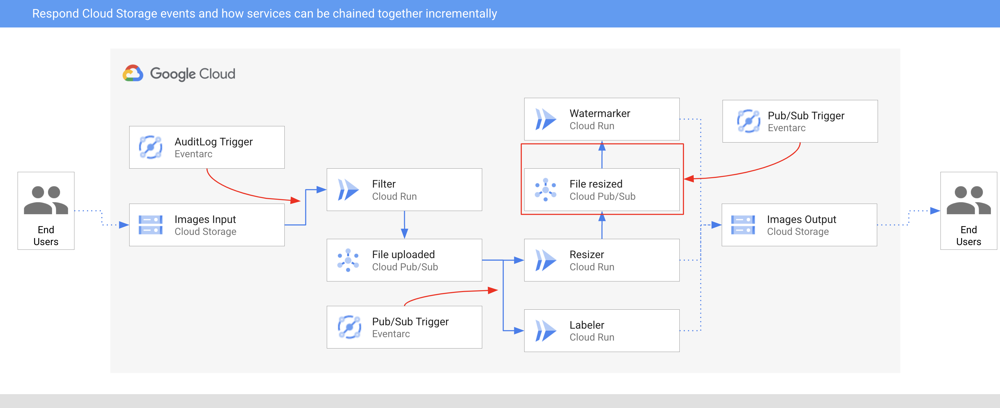

# Image Processing Pipeline - Eventarc for Cloud Run for Anthos

> **Note —** Eventarc for Cloud Run for Anthos is currently a feature in *private preview*.
> Only whitelisted projects can currently take advantage of it. Please stay
> tuned for the public preview!

In this sample, we'll build an image processing pipeline to connect Google Cloud
Storage events to various services with **Eventarc**.



1. An image is saved to an input Cloud Storage bucket.
2. Cloud Storage update event is read into Cloud Run via an `AuditLog`.
3. Filter service receives the Cloud Storage event. It uses Vision API to
   determine if the image is safe. If so, it creates sends a Pub/Sub message to
   `fileuploaded` topic.
4. Resizer service receives the event from `fileuploaded` topic, resizes the
   image using [ImageSharp](https://github.com/SixLabors/ImageSharp) library,
   saves to the resized image to the output bucket, sends a Pub/Sub message to
   `fileresized` topic.
5. Watermark service receives the event from `fileresized` topic, adds a
   watermark to the image using
   [ImageSharp](https://github.com/SixLabors/ImageSharp) library and saves the
   image to the output bucket.
6. Labeler receives the event from `fileuploaded` topic, extracts labels of the
   image with Vision API and saves the labels to the output bucket.

## Before you begin

Before deploying services and triggers, go through some setup steps.

### Enable APIs

Make sure that the project id is setup:

```sh
gcloud config set project [YOUR-PROJECT-ID]
PROJECT_ID=$PROJECT_ID
```

Enable all necessary services:

```sh
gcloud services enable run.googleapis.com
gcloud services enable eventarc.googleapis.com
gcloud services enable cloudbuild.googleapis.com
gcloud services enable vision.googleapis.com
```

### Enable Audit Logs

You will use [Audit Logs](https://console.cloud.google.com/iam-admin/audit)
trigger for Cloud Storage. Make sure `Admin Read`, `Data Read`, and `Data Write`
log types are enabled for Cloud Storage.

### Region, location, platform

Set region, location and platform for Cloud Run and Eventarc:

```sh
CLUSTER_NAME=events-cluster
CLUSTER_LOCATION=us-central1

gcloud config set run/cluster $CLUSTER_NAME
gcloud config set run/cluster_location $CLUSTER_LOCATION
gcloud config set run/platform gke
gcloud config set eventarc/location $CLUSTER_LOCATION
```

### Create a GKE cluster

Create a GKE cluster with Cloud Run for Anthos add-on and also Workload
Identity (WI). The cluster needs to have WI enabled. WI is the recommended way
to access Google Cloud services from applications running within GKE due to its
improved security properties and manageability. It is needed to properly set up
the Event Forwarder of Eventarc. See [Using Workload Identity](https://cloud.google.com/kubernetes-engine/docs/how-to/workload-identity#enable_on_cluster) for more details.

```sh
gcloud beta container clusters create $CLUSTER_NAME \
  --addons=HttpLoadBalancing,HorizontalPodAutoscaling,CloudRun \
  --machine-type=n1-standard-4 \
  --enable-autoscaling --min-nodes=3 --max-nodes=10 \
  --no-issue-client-certificate --num-nodes=3  \
  --enable-stackdriver-kubernetes \
  --scopes=cloud-platform,logging-write,monitoring-write,pubsub \
  --zone us-central1 \
  --release-channel=rapid \
  --workload-pool=$PROJECT_ID.svc.id.goog
```

### Authenticate to Google Cloud

Make sure apps we'll deploy can authenticate to Google Cloud using Workload
Identity. To do this, configure a Kubernetes service account (eg. default
Kubernetes service account) to act as a Google service account (eg. default
compute service account).

Allow the default Kubernetes service account to impersonate the default Google
compute service account by creating an IAM policy binding between the two:

```sh
PROJECT_NUMBER="$(gcloud projects describe $(gcloud config get-value project) --format='value(projectNumber)')"

gcloud iam service-accounts add-iam-policy-binding \
  --role roles/iam.workloadIdentityUser \
  --member "serviceAccount:$PROJECT_ID.svc.id.goog[default/default]" \
  $PROJECT_NUMBER-compute@developer.gserviceaccount.com
```

Add the `iam.gke.io/gcp-service-account` annotation to the Kubernetes service
account, using the email address of the Google service account:

```sh
kubectl annotate serviceaccount \
  --namespace default \
  default \
  iam.gke.io/gcp-service-account=$PROJECT_NUMBER-compute@developer.gserviceaccount.com
```

### Enable GKE destinations in Eventarc

Enable GKE destinations in Eventarc but creating a service account and binding the required roles with this command:

```sh
gcloud eventarc gke-destinations init
```

### Configure a service account

Create another service account with `roles/pubsub.subscriber` and
`roles/monitoring.metricWriter` roles. This is the minimum needed for Pub/Sub
triggers. For AuditLog triggers, you also need `roles/eventarc.eventReceiver` role:

```sh
TRIGGER_GSA=eventarc-crfa-triggers

gcloud iam service-accounts create $TRIGGER_GSA

gcloud projects add-iam-policy-binding $PROJECT_ID \
  --member "serviceAccount:$TRIGGER_GSA@$PROJECT_ID.iam.gserviceaccount.com" \
  --role "roles/pubsub.subscriber"

gcloud projects add-iam-policy-binding $PROJECT_ID \
  --member "serviceAccount:$TRIGGER_GSA@$PROJECT_ID.iam.gserviceaccount.com" \
  --role "roles/monitoring.metricWriter"

gcloud projects add-iam-policy-binding $PROJECT_ID \
  --member "serviceAccount:$TRIGGER_GSA@$PROJECT_ID.iam.gserviceaccount.com" \
  --role "roles/eventarc.eventReceiver"
```

You will use this service account in the Pub/Sub and Audit Log triggers later.

### Create storage buckets

Create 2 unique storage buckets to save pre and post processed images. Make sure
the bucket is in the same region as your Cloud Run service:

```sh
BUCKET1=$PROJECT_ID-images-input-gke
BUCKET2=$PROJECT_ID-images-output-gke
gsutil mb -l $CLUSTER_LOCATION gs://$BUCKET1
gsutil mb -l $CLUSTER_LOCATION gs://$BUCKET2
```

## Watermark

This service receives the event, adds the watermark to the image using
[ImageSharp](https://github.com/SixLabors/ImageSharp) library and saves the
image to the output bucket.

### Service

The code of the service is in [watermarker](../processing-pipelines/image/watermarker)
folder.

Inside the top level
[processing-pipelines](../processing-pipelines)
folder, build and push the container image:

```sh
SERVICE_NAME=watermarker
docker build -t gcr.io/$PROJECT_ID/$SERVICE_NAME:v1 -f image/$SERVICE_NAME/csharp/Dockerfile .
docker push gcr.io/$PROJECT_ID/$SERVICE_NAME:v1
```

Deploy the service:

```sh
gcloud run deploy $SERVICE_NAME \
  --image gcr.io/$PROJECT_ID/$SERVICE_NAME:v1 \
  --update-env-vars BUCKET=$BUCKET2
```

### Trigger

Create a Pub/Sub trigger:

```sh
TRIGGER_NAME=trigger-$SERVICE_NAME-gke
gcloud eventarc triggers create $TRIGGER_NAME \
  --destination-gke-cluster=$CLUSTER_NAME \
  --destination-gke-location=$CLUSTER_LOCATION \
  --destination-gke-namespace=default \
  --destination-gke-service=$SERVICE_NAME \
  --destination-gke-path=/ \
  --event-filters="type=google.cloud.pubsub.topic.v1.messagePublished" \
  --service-account=$TRIGGER_GSA@$PROJECT_ID.iam.gserviceaccount.com
```

Set the Pub/Sub topic in an env variable that we'll need later:

```sh
TOPIC_FILE_RESIZED=$(basename $(gcloud eventarc triggers describe $TRIGGER_NAME --format='value(transport.pubsub.topic)'))
```

## Resizer

This service receives the event, resizes the image using
[ImageSharp](https://github.com/SixLabors/ImageSharp) library and passes the
event onwards.

### Service

The code of the service is in [resizer](../processing-pipelines/image/resizer)
folder.

Inside the top level
[processing-pipelines](../processing-pipelines)
folder, build and push the container image:

```sh
SERVICE_NAME=resizer
docker build -t gcr.io/$PROJECT_ID/$SERVICE_NAME:v1 -f image/$SERVICE_NAME/csharp/Dockerfile .
docker push gcr.io/$PROJECT_ID/$SERVICE_NAME:v1
```

Deploy the service:

```sh
gcloud run deploy $SERVICE_NAME \
  --image gcr.io/$PROJECT_ID/$SERVICE_NAME:v1 \
  --update-env-vars BUCKET=$BUCKET2,TOPIC_ID=$TOPIC_FILE_RESIZED,PROJECT_ID=$PROJECT_ID
```

### File uploaded Pub/Sub topic

Create a Pub/Sub topic for resizer and labeler services to share in their triggers.

```sh
TOPIC_FILE_UPLOADED=file-uploaded
gcloud pubsub topics create $TOPIC_FILE_UPLOADED
```

### Trigger

Create a Pub/Sub trigger with the `TOPIC_FILE_UPLOADED` as transport topic:

```sh
TRIGGER_NAME=trigger-$SERVICE_NAME-gke
gcloud eventarc triggers create $TRIGGER_NAME \
  --destination-gke-cluster=$CLUSTER_NAME \
  --destination-gke-location=$CLUSTER_LOCATION \
  --destination-gke-namespace=default \
  --destination-gke-service=$SERVICE_NAME \
  --destination-gke-path=/ \
  --event-filters="type=google.cloud.pubsub.topic.v1.messagePublished" \
  --transport-topic=projects/$PROJECT_ID/topics/$TOPIC_FILE_UPLOADED \
  --service-account=$TRIGGER_GSA@$PROJECT_ID.iam.gserviceaccount.com
```

## Labeler

Labeler receives the event, extracts labels of the image with Vision API and
saves the labels to the output bucket.

### Service

The code of the service is in [labeler](../processing-pipelines/image/labeler)
folder.

Inside the top level
[processing-pipelines](../processing-pipelines)
folder, build and push the container image:

```sh
SERVICE_NAME=labeler
docker build -t gcr.io/$PROJECT_ID/$SERVICE_NAME:v1 -f image/$SERVICE_NAME/csharp/Dockerfile .
docker push gcr.io/$PROJECT_ID/$SERVICE_NAME:v1
```

Deploy the service:

```sh
gcloud run deploy $SERVICE_NAME \
  --image gcr.io/$PROJECT_ID/$SERVICE_NAME:v1 \
  --update-env-vars BUCKET=$BUCKET2
```

### Trigger

Create a Pub/Sub trigger with the `TOPIC_FILE_UPLOADED` as transport topic:

```sh
TRIGGER_NAME=trigger-$SERVICE_NAME-gke
gcloud eventarc triggers create $TRIGGER_NAME \
  --destination-gke-cluster=$CLUSTER_NAME \
  --destination-gke-location=$CLUSTER_LOCATION \
  --destination-gke-namespace=default \
  --destination-gke-service=$SERVICE_NAME \
  --destination-gke-path=/ \
  --event-filters="type=google.cloud.pubsub.topic.v1.messagePublished" \
  --transport-topic=projects/$PROJECT_ID/topics/$TOPIC_FILE_UPLOADED \
  --service-account=$TRIGGER_GSA@$PROJECT_ID.iam.gserviceaccount.com
```

## Filter

This service receives Cloud Storage events for saved images. It uses Vision API
to determine if the image is safe. If so, it passes a custom event onwards.

### Service

The code of the service is in
[filter](../processing-pipelines/image/filter)
folder.

Inside the top level
[processing-pipelines](../processing-pipelines)
folder, build and push the container image:
image:

```sh
SERVICE_NAME=filter
docker build -t gcr.io/$PROJECT_ID/$SERVICE_NAME:v1 -f image/$SERVICE_NAME/csharp/Dockerfile .
docker push gcr.io/$PROJECT_ID/$SERVICE_NAME:v1
```

Deploy the service:

```sh
gcloud run deploy $SERVICE_NAME \
  --image gcr.io/$PROJECT_ID/$SERVICE_NAME:v1 \
  --update-env-vars BUCKET=$BUCKET1,TOPIC_ID=$TOPIC_FILE_UPLOADED,PROJECT_ID=$PROJECT_ID
```

### Trigger

The trigger of the service filters on Audit Logs for Cloud Storage events with
`methodName` of `storage.objects.create`.

Create the trigger:

```sh
TRIGGER_NAME=trigger-$SERVICE_NAME-gke
gcloud eventarc triggers create $TRIGGER_NAME \
  --destination-gke-cluster=$CLUSTER_NAME \
  --destination-gke-location=$CLUSTER_LOCATION \
  --destination-gke-namespace=default \
  --destination-gke-service=$SERVICE_NAME \
  --destination-gke-path=/ \
  --event-filters="type=google.cloud.audit.log.v1.written" \
  --event-filters="serviceName=storage.googleapis.com" \
  --event-filters="methodName=storage.objects.create" \
  --service-account=$TRIGGER_GSA@$PROJECT_ID.iam.gserviceaccount.com
```

## Test the pipeline

Before testing the pipeline, make sure all the triggers are ready:

```sh
gcloud eventarc triggers list

NAME
trigger-filter-gke
trigger-resizer-gke
trigger-watermarker-gke
trigger-labeler-gke
```

You can upload an image to the input storage bucket:

```sh
gsutil cp beach.jpg gs://$BUCKET1
```

After a minute or so, you should see resized, watermarked and labelled image in
the output bucket:

```sh
gsutil ls gs://$BUCKET2

gs://events-atamel-images-output/beach-400x400-watermark.jpeg
gs://events-atamel-images-output/beach-400x400.png
gs://events-atamel-images-output/beach-labels.txt
```
