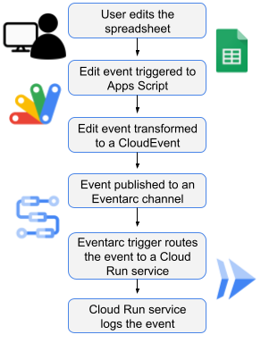
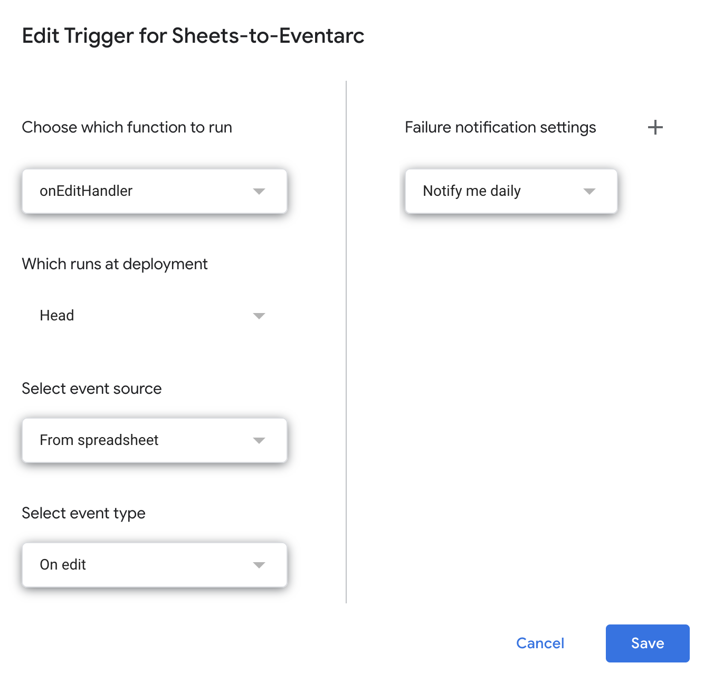
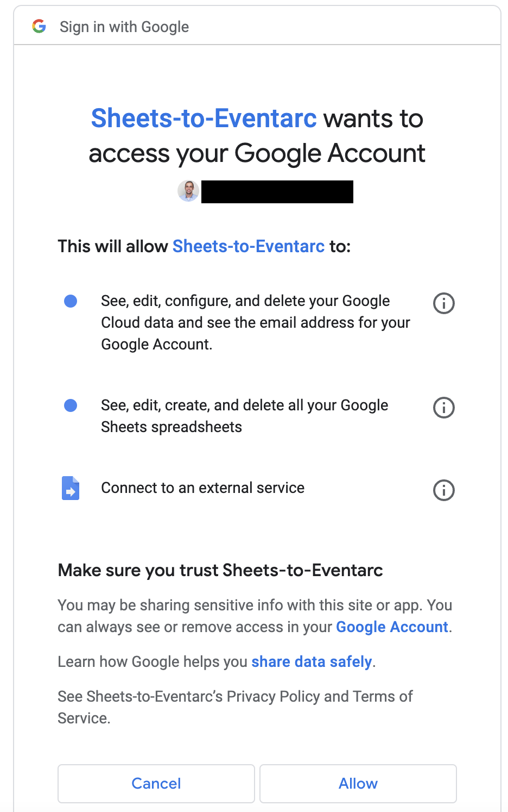
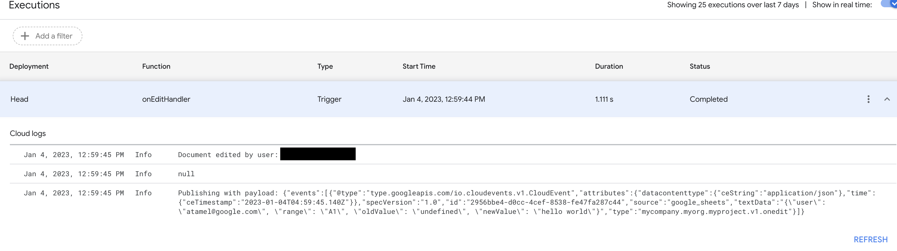
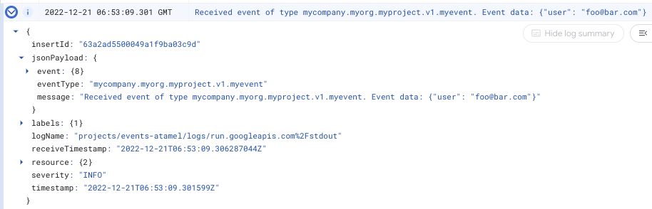

# Triggering Eventarc from Google Sheets via a custom channel

> **Note:** Eventarc custom channels is a feature in *private preview*.
> Only allow-listed projects can currently take advantage of it. Please contact
> eventarc@google.com to get your project allow-listed before attempting this
> sample.

In this sample, we show you how to detect users edit events in a Google Sheets
spreadsheet and send the edit event details to a Cloud Run service via a custom
channel in Eventarc. More specifically:

1. A user edits a Google Sheets spreadsheet. The edit event is captured in
   Sheets and some info (user, old value, new value, cell) is extracted from the
   event.
1. A `CloudEvent` with the right format is created with the edit event and it is
   published to a custom channel in Eventarc.
1. Eventarc receives the custom event from the channel and passes to a Cloud Run
   service that simply logs the received event with the user id.



## Setup Eventarc

First, make sure you have a Google Cloud project and the project id is set in `gcloud`:

```sh
PROJECT_ID=your-project-id
gcloud config set project $PROJECT_ID
```

Run [setup.sh](setup.sh) to setup Eventarc, more specifically:

1. Enable required services.
1. Deploy a Cloud Run service as events destination to log events.
1. Create a custom channel for Google Sheets to publish custom events to.
1. Create a trigger to connect the channel to the service with an event-filter
   for a custom event type: `mycompany.myorg.myproject.v1.onedit`.

## Create a Google Sheet with Apps Script

Create a Google Sheet spreadsheet. In this spreadsheet, you will simply
capture the edit event, extract the relevant information and send it to
Eventarc as a custom event.

Create an Apps Script to capture edit events. Go to `Extensions` and `Apps
Script` in the spreadsheet. This opens up the App Script editor.

Replace the default code in `Code.gs` with the code in [Code.gs](Code.gs). Make
sure you replace the `PROJECT_ID` with your own project id and press `Save`
button. This code watches for edit events in Google Sheets, extracts the
relevant info and then creates a custom event to publish to Eventarc's custom
channel.

In App Script editor, go to `Project Settings` and check `Show appsscript.json
manifest file in editor`.  Go back to `Editor` and replace the contents of
`appscript.json` with [appscript.json](appscript.json). This makes sure that the
Apps Script has the required permissions.

Go to `Triggers` section and select `Add Trigger` to create a trigger to
watch for `On edit` events in Google Sheets and to send them to
`onEditHandler` function defined in the Apps Script:



Click `Save` and this will take you a sign in page.

## Authentication

As you're saving the trigger, you'll be prompted to sign in:



This basically determines what identity will be used to execute the trigger (even
when triggered by another user). You need to make sure the account you choose
has `roles/eventarc.publisher` role in the Google Cloud project.

In this sample, we simply use the same user as the owner of the Google Cloud
project.

## Test

You're now ready to test the end-to-end flow.

Go back to the sheet and edit a cell.

In App Script console, under `Executions`, you should see a new execution:



In Cloud Run logs, you should also see the received event:



Note: If another user edits the document, you will still get edit events but the
user field might be empty. This is due to security setup of Google Workspace.