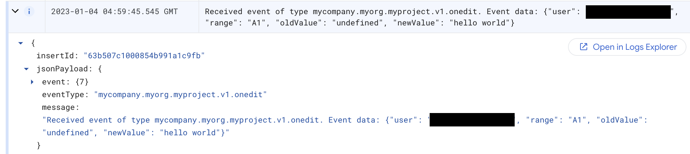

# Triggering Eventarc from Google Sheets via a custom channel

> **Note:** Eventarc custom channels is a feature in *private preview*.
> Only allow-listed projects can currently take advantage of it. Please contact
> eventarc@google.com to get your project allow-listed before attempting this
> sample.

In this sample, we show you how to detect users that open a Google Sheets
spreadsheet and send the user id to a Cloud Run service via a custom channel in
Eventarc. More specifically:

1. A user opens a Google Sheets spreadsheet. The `onOpen` event is captured in
   Sheets and the user id is extracted from the event.
1. A custom `CloudEvent` with the right format is created with the user id and the
   event is published to a custom channel in Eventarc.
1. Eventarc receives the custom event from the channel and passes to a Cloud Run
   service that simply logs the received event with the user id.

TODO: Add an architecture diagram

## Setup Eventarc

First, make sure you have a Google Cloud project and the project id is set in `gcloud`:

```sh
PROJECT_ID=your-project-id
gcloud config set project $PROJECT_ID
```

Run [setup.sh](setup.sh) to setup Eventarc, more specifically:

1. Enable required services.
1. Deploy a Cloud Run service as events destination to log events.
1. Create a custom channel for Google Sheets to publish custom events to.
1. Create a trigger to connect the channel to the service with an event-filter
   for a custom event type.

## Create a Google Sheet with Apps Script

Next, create a Google Sheet spreadsheet. In this spreadsheet, you will simply
capture the `onOpen` event, extract the user id from it and send it to Eventarc
as a custom event.

Create an Apps Script to capture `onOpen` events:

1. Go to `Extensions` and `Apps Script` in the spreadsheet. This opens up the
   App Script editor.
1. Replace the default code in `Code.gs` with the code in [Code.gs](Code.gs).
   Make sure you replace the `PROJECT_ID` with your own project id and press
   `Save` button. This code watches for `onOpen` events in Google Sheets,
   extracts the user id and then creates a custom event to publish to Eventarc's
   custom channel.
1. In App Script editor, go to `Project Settings` and check `Show
   appsscript.json manifest file in editor`. Go back to `Editor` and replace the
   contents of `appscript.json` with [appscript.json](appscript.json). This
   makes sure that the Apps Script has the required permissions.
1. Go to `Triggers` section and select `Add Trigger` to create a trigger to
   watch for `On open` events in Google Sheets and to send them to
   `onOpenHandler` function defined in the Apps Script:


## Setup authenticatoin

TODO: Right now, other users do not seem to work. Tha owner of the doc also
needs to be owner in the Google Cloud project and also need to click on run or
debug in Apps Script editor to give it the permission. Find another solution,
especially with respect to all users accessing the doc.

## Test

You're now ready to test the end-to-end flow.

Go back to the sheet and just refresh it.

In App Script console, under `Executions`, you should see a new execution:


In Cloud Run logs, you should also see the received event:


